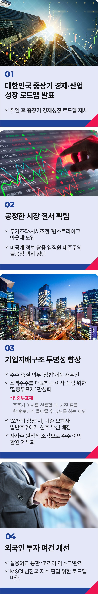

# 주식시장 활성화 공약


## K-주식 활성화, 경제강국의 길
### 회복과 성장으로 코리아 디스카운트를 해소해, 주가지수 5,000시대를 열겠습니다



```
회복과 성장으로 코리아 디스카운트를 해소해, 주가지수 5,000시대를 열겠습니다
```

대한민국 주식투자자가 1,400만 명을 넘어섰습니다. 이제 우리 국민도 제대로 자산을 키울 수 있는 선진화된 주식시장이 필요합니다.

그러나 실망과 좌절을 경험한 투자자들은 해외시장으로 눈을 돌리고 있습니다. 참으로 안타까운 현실입니다.

### 대한민국 주식시장의 활성화가 국민의 건전한 자산 증식을 위한 가장 쉽고 빠른 길입니다.

국민 대부분의 자산이 부동산인 현실을 바꿔야 합니다. 혁신적 기업을 믿고 투자할 수 있도록 자본시장을 매력적인 투자처로 만들어야 합니다.

국가가 경제·산업 미래 비전을 시장에 제시하고, 이해관계자와 대화와 타협을 통해 경영 효율을 저해하는 비정상적 지배구조를 단계적으로 개혁하겠습니다.

### 우선, 정부가 명확한 중장기 경제·산업 성장 로드맵을 발표하겠습니다.

그동안 정부가 발표한 각종 경제정책 방향은 구체성과 실현 가능성이 부족하거나 단기 처방에 그쳐 주식시장의 근본적 변화를 끌어내기에 역부족이었습니다.

정부가 집중투자 할 산업과 규모, 방식 등을 함께 제시함으로써, 민간이 투자 전략을 수립하고 실행하는 데 예측 가능성과 안정성을 더하겠습니다.

### 공정한 시장 질서를 확립하겠습니다.

시장 활성화는 공정성에서 비롯됩니다. 그동안 우리 주식시장에는 ‘주가조작으로 돈을 벌어도 힘만 있으면 처벌받지 않는다’는 깊은 불신이 퍼져 있었습니다.

주가조작, 시세조종 등 불공정 거래에 대한 강력한 대응이 필요합니다.

‘원스트라이크 아웃제’를 도입해 한 번이라도 주가조작에 가담하면, 다시는 주식시장에 발을 들일 수 없게 하겠습니다.

임직원과 대주주의 미공개 정보를 활용한 불공정 행위를 엄단하고, 단기차익 실현 환수를 강화하겠습니다. 주가조작 등 불공정거래 사전 모니터링과

범죄 엄단 시스템을 확실하게 보강하겠습니다.

### 기업지배구조의 투명성을 높이겠습니다.

한국의 기업지배구조 순위는 아시아 12개국 중 8위에 불과합니다. (*참고: 아시아기업지배구조협회 ACGA ‘CG Watch 2023’보고서)

불투명한 기업지배구조는 ‘코리아 디스카운트’의 고질적인 원인 중 하나입니다.

주주 이익 보호를 위한 상법 개정을 재추진하겠습니다. 소액주주를 대표하는 이사도 선임될 수 있도록 집중투표제를 활성화하겠습니다.

감사위원 분리 선출도 단계적으로 확대해 경영 감시 기능을 더욱 강화하겠습니다.

합병 시 기업가치는 공정하게 평가되도록 하고, 일반주주 보호장치도 강화하겠습니다.

‘쪼개기 상장’ 시 모회사의 일반주주에게 신주를 우선 배정하도록 제도를 개선하겠습니다.

상장회사의 자사주는 원칙적으로 소각해 주주 이익으로 환원될 수 있도록 제도화하겠습니다.

### 외국인 투자 환경도 대폭 개선하겠습니다.

국제 신용평가사들은 대한민국 국가신용 하방 요인으로 ‘코리아 리스크’를 지적합니다.

전략적 실용 외교로 때마다 반복되는 북한의 핵과 미사일 위협 등, 지정학적 안보리스크를 해소하겠습니다.

외국인이 안심하고 대한민국에 투자할 수 있는 신뢰 기반을 조성해 시장을 안심시키겠습니다.

MSCI 선진국 지수 편입을 위한 구체적인 로드맵을 마련하고, 외국인 투자자들의 불편을 해소하는 제도 개선에 나서겠습니다

### ‘코리아 디스카운트’ 시대를 끝내고, ‘코리아 프리미엄’ 시대를 열겠습니다.

주식시장은 투명하게 운용되고, 기업은 정당하게 평가받으며, 투자자 이익은 두텁게 보호하겠습니다.

공정하고 합리적인 기업경영과 시장 질서가 확립되면, 우리 주식시장은 획기적인 도약을 이룰 수 있을 것입니다.

### 대한민국의 회복과 성장으로 코스피 5,000시대를 실현하겠습니다.

이제부터 진짜 대한민국, 지금은 이재명입니다.
