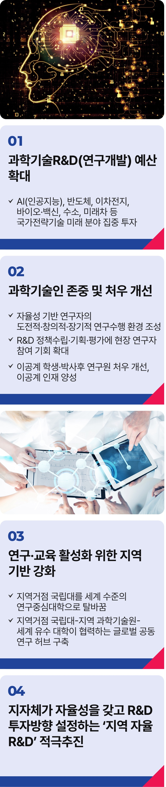

# 과학기술 공약


## K-이니셔티브의 기반, 과학기술
### 기술패권의 시대, 첨단 과학기술로 세계를 주도하는 과학강국 대한민국을 만들겠습니다



```
기술패권의 시대, 첨단 과학기술로 세계를 주도하는 과학강국 대한민국을 만들겠습니다
```

과학기술이 국가의 흥망성쇠를 결정하는 기술 패권의 시대에 맞는 ‘과학의 날’입니다.

가뜩이나 힘들고 어려운 연구 현장을 지키며 오늘도 연구에 매진하고 계신 과학기술인 여러분께 깊은 감사를 드립니다.

“과학의 승리자는 모든 것의 승리자다. 한 개의 시험관은 전 세계를 뒤집는다” - 1934년 처음 지정된 ‘과학데이’의 구호입니다.

우리 선대들은 암흑과도 같았던 일제강점기에도 ‘과학의 날’을 만들어 과학강국을 꿈꾸었습니다.

식민 치하에서도 과학기술의 중요성을 깨닫고, 미래를 준비한 선견지명에 절로 고개가 숙여집니다.

*최초의 ‘과학데이’는 찰스다윈 사망일인 4월 19일. 일제 탄압으로 5회 만에 중단. 이후 과학기술처 발족일인 4월 21일로 정해짐.

김대중-노무현-문재인 대통령으로 이어지는 민주정부는 IMF 경제위기와 코로나19라는 세계적 전염병의 국난 속에서도 R&D 예산을 늘리고, 우주로
진출할 계획을 세웠습니다.

과학기술을 국정 중심에 두고, 꾸준히 선진 대한민국의 길을 닦았습니다.
과학기술이 존중받고 과학기술인들을 우대했을 때 나라는 흥했고, 그렇지 못했을 때 뒤쳐졌습니다.

첨단 과학기술이야말로 세계를 주도하는 진짜 대한민국의 근간이고, K-이니셔티브의 핵심 자산입니다.

이제, 발상을 전환해야 합니다.

과감한 투자와 초격차의 압도적 기술만이 세계를 주도할 수 있습니다.

과학기술 R&D 예산을 대폭 확대하겠습니다.

예산은 국가가 나아갈 방향을 가리키는 나침반과 같습니다.

올해 총 정부 지출 기준 R&D 예산은 4.4%에 불과합니다.

대한민국을 과학기술 강국으로 만들기 위해서는 훨씬 더 과감한 투자가 필요합니다.

퇴행한 R&D 예산을 바로잡아 무너진 연구 생태계를 다시 일으켜 세워야 합니다.

특히 인공지능(AI), 반도체, 이차전지, 바이오·백신, 수소, 미래차 등 국가전략기술 미래 분야를 키우는 데 집중하겠습니다.

과학기술인들이 연구에만 매진할 수 있도록 정부가 든든히 뒷받침하겠습니다.

연구개발도 결국 사람의 일입니다. 김대중 대통령께서는 “일류국가로 발돋움하기 위해서는 과학기술자가 존경받는 사회가 되어야 한다”라고 말씀하셨습니다.

긴 호흡으로 쉽게 포기하거나, 좌절하지 않도록 기회가 주어져야 합니다.

정해진 답 대신, 판을 바꾸는 게임체인저가 되려면 창의력을 마음껏 발휘할 수 있는 연구 환경이 보장되어야 합니다.

과학기술인들이 존중받는 만큼, 과학기술도 융성하게 될 것입니다.

연구자의 자율성을 기반으로 도전적, 창의적, 장기적 연구 수행이 가능한 환경을 만들겠습니다.

R&D 정책 수립과 기획, 평가에 현장 연구자들의 목소리를 대폭 반영하겠습니다.

이공계 학생과 박사후 연구원의 처우 개선과, 이공계 핵심 인재 양성을 전폭적으로 지원해 인재가 떠나지 않고 모이는 대한민국을 만들겠습니다.

연구·교육 활성화를 위한 지역 기반도 강화하겠습니다.

지방거점국립대가 세계 수준의 연구중심대학이 될 수 있도록 집중적으로 투자해야 합니다.

이를 위해 지역거점 국립대와 지역 과학기술원, 세계 유수 대학이 협력할 수 있는 글로벌 공동연구 허브를 구축하겠습니다.

지자체가 자율성을 갖고 R&D 투자의 방향을 설정할 수 있도록 ‘지역 자율 R&D’를 적극 추진하겠습니다.

당면한 지역의 문제는 사실 대한민국이 풀어야 할 과제이기도 합니다.

따라서 해당 지역 지자체가 이를 해결하는 과정에 직접 참여하는 것이 중요합니다.

한걸음 뒤처지면 도태되기 쉬운 추격자일 뿐이지만, 반걸음만 앞서가면 무한한 기회를 누리는 선도자가 될 수 있습니다.

그 중심에 첨단 과학기술이 있습니다.

뿌리 깊은 나무가 바람에 흔들리지 않듯, 과학기술이 강한 나라는 흔들림 없이 번영하고 세계를 주도할 것입니다.

우리의 역량과 지혜를 모두 모아 과학강국 대한민국을 만들겠습니다.

과학이 강한 나라, 이제부터 진짜 대한민국입니다.

지금은 이재명입니다.