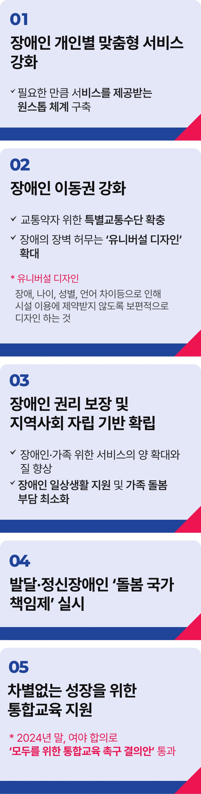

# 장애인 공약


## 장애인 권리보장 복지강국!
### 모두가 당연한 권리를 누리는 나라, 진짜 대한민국을 시작하겠습니다



```
모두가 당연한 권리를 누리는 나라,
진짜 대한민국을 시작하겠습니다
```

우리 모두 알고 있습니다.

다음 층으로 가는 길을 내주는 계단이 누군가에게는 넘을 수 없는 금지선이 됩니다.

우리는 때가 되면 누구나 당연히 자립한다 여기지만, 가족과 공동체의 돌봄과 국가 지원 없이 온전히 서는 일은 쉽지 않습니다.

세상에 나온 것부터, 우리가 가진 특징 그 모두 우리가 원해서, 스스로 선택해 가진 것은 아닙니다.

그런데도 장애를 갖고 태어났다는 이유로, 사고로 장애를 얻게 되었다는 이유로, 일상의 많은 것을 마음껏 누릴 수 없는 이들이 있습니다.

가족이 가족을 돌보기 위해 생업을 포기하기도 하고, 자식만 혼자 두고 차마 떠날 수 없는 부모가 차라리 함께 삶을 놓아 버리자고 마음먹기도 합니다.

지금, 이 순간에도 어디에선가 일어나고 있는 일입니다. 이제는 막아야 합니다.

누구나 원하는 삶을 꿈꿀 수 있고 쟁취할 수 있는 그런 나라가, 진짜 대한민국이 되어야 합니다.

장애가 꿈과 희망을, 하루하루의 일상을 발목 잡지 않고 모든 대한국민이 당연한 권리를 누리는 그런 나라, 진짜 대한민국으로 나아가겠습니다.

장애인 당사자가 정당한 권리를 떳떳하게 요구할 수 있도록 권리의 중심에 서야 합니다.

동등한 권리자로 우리 모두의 시선과 인식을 드높일 시점의 대전환이 필요합니다.

장애인을 보호의 대상이 아닌 당당한 권리의 주체로, 당사자의 참여로 만들어지는 장애인 정책으로 나아가야 합니다.

일상 곳곳의 장벽을 정비하여 장애로 인한 차별이 없는 진짜 대한민국을 만들겠습니다.

장애인 개인별 맞춤형 서비스를 강화하겠습니다.

가까운 곳에서, 필요한 만큼 서비스를 제공받는 원스톱 체계를 구축하겠습니다.

우리 국민의 약 30%, 1,500만 명이 교통약자입니다.

누구나 자유롭게 이동할 수 있도록 교통시설을 개선하고, 특별교통수단을 확충하겠습니다.

모두를 위한 설계, ‘유니버설 디자인’도 확대하겠습니다.

장애인 권리 보장으로 지역사회 자립 기반을 확립하겠습니다.

장애인과 가족의 불편을 최소화할 수 있도록 국가가 나서 서비스의 양은 늘리고, 질은 높이겠습니다.

장애인의 일상생활 지원을 늘려 가족의 돌봄 부담을 최소화하겠습니다.

‘발달장애인과 정신장애인 돌봄 국가책임제’를 실시하겠습니다.

일가족의 삶이 서서히 무너지는 비극의 반복을 더는 방치할 수 없습니다.

작년 말 여야 합의로 ‘모두를 위한 통합교육 촉구 결의안’이 통과 되었습니다.

취지대로 모든 장애 학생이 차별 없이 함께 배우고 성장할 수 있는 교육 환경을 만들도록 노력하겠습니다.

AI·디지털 기술 등을 활용한 맞춤형 장애인 지원 체계도 먼 미래의 이야기가 아닐 것입니다.

대한국민으로서 모두가 당연한 권리를 누리는 나라, 장애인도, 비장애인도 서로 다름을 존중하며 함께 살아가는 나라, 가족과 공동체, 국가

안에서 모두가 더불어 사는 세상을 만들겠습니다.

함께 하겠습니다. 함께 바꾸겠습니다.

이제부터 진짜 대한민국,

지금은 이재명입니다.