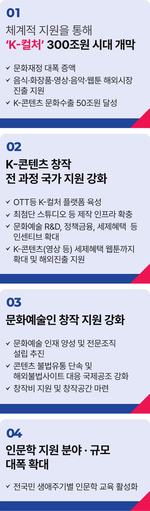

# 문화예술 공약


## K-컬처 문화강국 달성
### 글로벌 소프트파워 Big5 문화강국을 만들겠습니다.



```
문화강국, 글로벌 소프트파워 Big5로 거듭나겠습니다
```

오징어 게임이 세계인을 놀라게 하고 마침내 한강 작가는 노벨상을 수상했습니다.

가난한 시절 제주도를 배경으로 한 우리 드라마에 세계인이 눈물을 펑펑 흘립니다.

대한민국에서 통하면 세계에서도 통합니다.

대한국민의 안목이 세계의 기준이 되고 있습니다.

김구 선생이 꿈꾸었던 문화강국이라는 미래가 지금 바로 우리 눈앞 가까이에서 펼쳐지고 있습니다.

문화예술 산업계 종사자들이 일궈낸 K-콘텐츠 열풍, 국가가 날개를 달아드리겠습니다.

소프트파워 BIG 5, 확고한 문화강국으로 거듭나겠습니다.

우리 문화재정은 올해 기준 국가 총지출의 1.33%에 불과합니다.

문화강국에 부합하는 수준으로 대폭 늘리겠습니다.

K-푸드, K-뷰티, K-팝, K-드라마, K-웹툰의 세계 시장 진출을 전폭 지원하겠습니다

2030년까지 시장 규모 300조 원, 문화수출 50조 원 시대를 열겠습니다.

K-콘텐츠 창작 전 과정에 국가 지원을 강화하겠습니다.

K-컬처 플랫폼을 육성해 콘텐츠 제작부터 글로벌시장 진출, 콘텐츠 유통까지 전 단계를 체계적으로 뒷받침하겠습니다.

영상 제작에 필요한 버츄얼 스튜디오 등 공공이 제작 인프라를 적극 확충해가겠습니다.

문화예술 R&D, 정책금융, 세제 혜택 등 전방위적 인센티브를 확대해 K-콘텐츠 산업의 지속가능한 성장을 지원하겠습니다.

웹툰산업도 K-컬처의 핵심축으로 육성하겠습니다.

영상 콘텐츠에 적용되는 세제 혜택을 웹툰 분야까지 확대하고, 번역과 배급, 해외마케팅을 아울러 중소기업의 해외 진출도 적극 지원하겠습니다.

문화예술인이 창작에만 전념할 수 있는 환경을 조성하겠습니다.

문화예술 인재 양성과 지원제도를 확대하고, 이를 뒷받침할 전문조직 설립도 추진하겠습니다.

콘텐츠 불법유통을 단호히 차단하고, 해외 불법 사이트는 국제공조로 대응해 지식재산권을 단단히 보호하겠습니다.

문화예술인에게 창작비와 창작 공간 등을 제공해 창작활동에만 집중할 수 있는 안정적 생태계를 구축하겠습니다.

인문학 지원을 강화해 문화강국의 토대를 견고히 하겠습니다.

인문학적 소양은 창작의 원천이며, 그 자체로도 문화예술의 중요한 자원입니다.

인문학 창작·출판 지원 범위와 규모를 대폭 확대하고, 비판적 사고력, 창의력, 인문학적 소양을 키울 수 있는 인문학 교육을 활성화하겠습니다.

김대중 전 대통령께서는‘21세기는 문화의 시대이며, 문화산업은 21세기의 핵심 산업이 될 것이다.’라고 말씀하셨습니다.

선대들은 늘 문화강국의 꿈을 꾸셨고
, 지금 우리에게 그 꿈을 현실로 만들 능력이 있습니다.

진짜 대한민국 그 꿈에 날개를 달겠습니다.

문화강국, 이제부터 진짜 대한민국입니다,
지금은 이재명입니다.