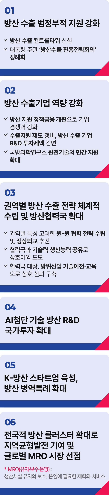

# K-방산 공약


## K-방산 글로벌 4대강국(G4) 달성
### 대한민국을 글로벌 방위산업 4대 강국으로 만들겠습니다.



```
대한민국을 글로벌 방위산업 4대 강국으로 만들겠습니다
```

소총 한 자루도 만들지 못하던 대한민국이 매일 K-방산의 새로운 역사를 쓰고 있습니다.

국내 7개 주요 방산기업 수주 잔액이 작년 말 100조 원을 돌파했습니다.

국산 대공방어무기 체계와 초대형 최첨단 탄두 기술은 북한의 연이은 핵미사일 위협에도 굴하지 않는 ‘강한 안보’의 핵심 자산입니다.

K-방산은 반도체, 이차전지, 미래 자동차 등과 더불어 한국 경제를 이끌어갈 미래 먹거리입니다.

강력한 제조업을 기반으로 AI 첨단기술로 무장한 K-방산이야말로 우리 경제의 저성장 위기를 돌파할 신성장 동력이자, 국부 증진의 중요한 견인차임을
저는 확신합니다.

이를 위해서는 범정부적 지원체계 강화가 필요합니다.

방산수출 컨트롤타워를 신설하고, 대통령 주재 방산수출진흥전략회의를 정례화해야 합니다.

방산 지원 정책금융 체계를 재편하고, 방산 수출 기업의 R&D 세액을 감면해 우리 기업의 경쟁력을 더욱 강화해야 합니다.

국방과학연구소가 보유한 원천기술이 적재적소에 활용될 수 있는 지원 방안도 마련해야 합니다.

유럽, 중동, 동남아와 인도, 미국과 중남미 등 권역별 특성을 고려한 윈-윈 협력 전략을 수립하고,
방산 기술이전과 교육으로 상호 신뢰를 구축해 방산협력국을 적극 확대해야 합니다.

3년 넘게 이어지고 있는 러시아·우크라이나 전쟁은 전쟁 양상의 극명한 변화를 그대로 보여주고 있습니다.

첨단 과학기술에 비례해 빛의 속도로 변화하는 전장에 대응하기 위해서도 R&D 국가 투자 확대는 ‘선택이 아닌 필수’입니다.

K-방산 스타트업을 육성하고, 방산 병역특례를 확대해 K-방산 인재를 적극 양성해야 합니다.

지역의 주력산업과 연구개발 역량을 방산과 융합하는 방산 클러스터를 확대 운영해야 합니다.

이는 지역균형발전과 글로벌 MRO(유지·보수·정비) 시장 선점의 의미있는 성과로 이어질 것입니다.

대한민국은 이제 ‘모방’에서 ‘주도’로 패러다임을 전환해야 합니다.

지능형 강군 건설에 꼭 필요한 AI 기반 게임 체인저 기술개발과 전력화!

대한민국 경제 산업의 앞자리에 세계 4대 K-방산 강국의 미래가 굳건히 자리 잡을 것임을 확신합니다.