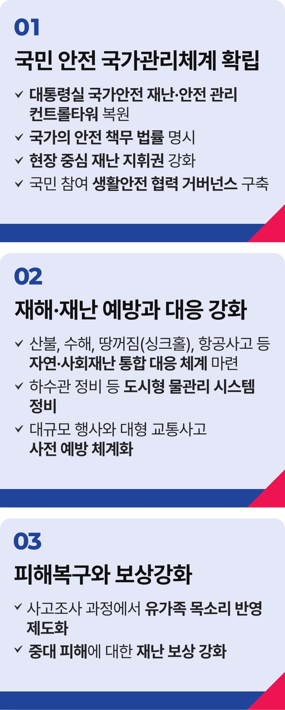

# 안전사회 공약


## 안전·안심 진짜 대한민국
### 국민의 생명과 안전을 최우선으로 하는 나라, 보다 안전하고 안심할 수 있는 진짜 대한민국을 만들겠습니다



```
국민의 생명과 안전을 최우선으로 하는 나라,
보다 안전하고 안심할 수 있는 진짜 대한민국을 만들겠습니다.
```

11년 전 오늘 있었던 세월호 참사는 304명이 희생된 1개의 사건이 아니라, 우리 곁의 소중한 가족과 이웃 304명을 잃은 304건의 참사였습니다.

세월호 참사는 우리에게 물었고, 지금도 묻고 있습니다. 도대체 ‘국가란 무엇인가?’, ‘국가는 왜 존재하는가?’ 국가가 당연히 국민을 지켜주리라 믿었지만
신뢰가 산산조각 났습니다.

대한민국은 세월호 이전과 이후로 나뉘었습니다. 참사의 아픔을 통해 달라졌어야 했습니다. 하지만 이태원 참사, 오송 지하차도 참사, 제주항공 참사 등
국가가 책임을 다하지 않은 대형 참사가 끊이지 않고 있습니다.

국민의 생명과 안전을 지키는 것은 국가의 책임입니다. 바로 세우겠습니다. 참사로 희생된 국민의 아까운 목숨이 헛되지 않고, 더는 유가족들이 차가운
거리에서 외롭게 싸우지 않도록, 국가의 책무를 다하겠습니다.

국민 안전 국가관리체계를 고도화하겠습니다. 대통령실을 국가안전 재난·안전 관리 컨트롤 타워로 복원하고, 국가의 안전 책무를 법률에
명시하겠습니다. 현장 중심 재난 지휘권을 강화하고, 국민 참여 생활안전 협력 거버넌스를 구축하겠습니다.

재해‧재난 예방과 대응도 더 촘촘히 하겠습니다. 산불, 수해, 땅꺼짐(싱크홀), 항공사고 등 자연‧사회재난 전반에 대한 통합 대응 체계를 마련하겠습니다.

하수관 정비 등 도시형 물관리 시스템을 정비하고, 대규모 행사와 교통사고 예방도 사전에 체계화하겠습니다.

피해복구와 보상을 강화하겠습니다. 유가족의 목소리를 제도적으로 반영하고, 중대 피해에 대한 재난 보상을 강화하겠습니다. 국민의 고통에 끝까지
함께하겠습니다.

국가의 무능과 무책임으로 희생되신 모든 분의 명복을 빕니다. 지금도 상실의 슬픔에 마음을 다 여미지 못한 유가족분들께 깊은 위로의 말씀을 드립니다.

국민의 생명과 안전보다 소중한 가치는 없습니다. 그 책임을 끝까지 지겠습니다.

이제부터 진짜 대한민국,
지금은 이재명입니다.