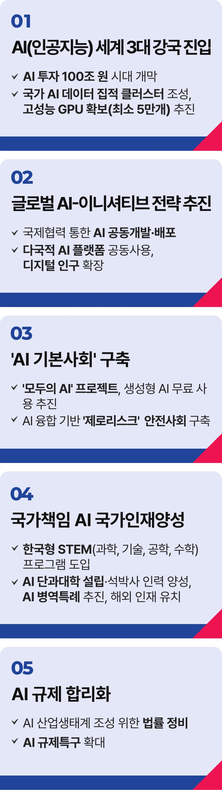

# AI 공약


## K-AI 이니셔티브 전략
### K-AI 이니셔티브를 확보할 이재명의 약속



```
AI 세계 3대 강국으로 우뚝 서겠습니다
```

챗GPT와 딥시크는 전 세계를 놀라게 했습니다. AI는 동시대 세계 경제의 판도를 바꿀 게임체인저입니다.

대한민국은 이제 추격 국가가 아니라 첨단과학 기술로 세계의 미래를 설계하고 글로벌 질서와 문명을 이끄는 선도 국가여야 합니다.
K-이니셔티브에 있어 K-AI가 필수인 까닭입니다.

AI 투자 100조원 시대를 열겠습니다. 정부가 민간 투자의 마중물이 되어 AI 관련 예산을 선진국을 넘어서는 수준까지 증액하고자 합니다.

유명무실했던 대통령 직속 기구 ‘국가인공지능위원회’를 내실있게 강화해 본격적 K-AI 시대를 다지겠습니다. 기술자, 연구자, 투자기업과
정부의 협력을 대통령인 위원장이 직접 살피는 명실상부한 중심 기구로 재편하겠습니다.

국가 AI 데이터 집적 클러스터를 조성해 글로벌 AI 허브의 기반을 만들겠습니다.

AI 핵심 자산인 GPU를 최소 5만 개 이상 확보하고, AI 전용 NPU 개발과 실증을 적극 지원해 기술 주권을 확보하겠습니다. 기업의
연구‧개발 지원을 위한 공공 데이터도 민간에 적극 개방하겠습니다.
국제협력으로 글로벌 AI 이니셔티브를 확보하겠습니다.

AI 초성장 사회로의 도약에는 글로벌 협력 체계가 절실합니다.

글로벌 AI 공동투자기금을 조성하고, 협력국 간 공용으로 사용가능한 기술을 개발하겠습니다. 이를 기반으로 태평양, 인도, 중동 국가까지
협력이 확대되어 다국적 데이터 활용이 가능해진다면 디지털 인구가 10억 명까지 늘어날 수 있습니다. K-이니셔티브에 걸맞는 K-AI를
주도할 기반이 마련될 것입니다.

국가가 AI 인재 양성을 책임지겠습니다. AI의 성패는 결국 인공지능(AI)을 설계하고 학습시키는 사람의 역량에 달려 있습니다.

우리는 빠른 속도로 성장해 가난한 나라에서 세계 10대 경제강국 대열에 올랐습니다.

이제는 양적 성장이라는 목표만 보고 달리느라 ‘빠뜨린 것’ ‘빼먹은 것’을 채워 넣어야 합니다. 창의력과 문제 해결력을 바탕으로 혁신적이고
개방적인 사고를 하는 인재를 키워내겠습니다.

AI를 위한 STEM 프로그램을 도입해 과학·기술·공학·수학 교육, 즉 STEM(Science, Technology, Engineering, Mathematics)교육을
강화해야 합니다.

지역별 거점대학에 AI 단과대학을 설립하고, 석박사급 전문 인재를 더 양성하겠습니다.

AI 분야 우수 인재의 병역특례를 확대해 과학기술 연구에 전념할 수 있도록 하겠습니다.

국내 인재를 체계적으로 양성하는 한편, 해외 인재도 과감히 유치해 글로벌 AI 이니셔티브를 확보하겠습니다.

제조업, ICT, 뷰티산업, 방위산업 등 다양한 산업과 연계된 AI 융복합 인재 육성도 지원하겠습니다.

AI 규제를 합리화하겠습니다.

우리 기업이 기술을 개발하고 제대로 투자받기도 전에 불합리한 AI 규제로 위축된 바는 없는지 면밀히 점검해야 합니다. 기업이 불필요한
규제에 시달리지 않고 온전히 기술 개발에 몰두할 수 있도록 AI 관련 규제를 합리화하겠습니다.

AI 산업 생태계 조성 관련법을 정비하고, 특허법, 출입국관리법 등 규제 특례가 적용될 AI 특구도 과감하게 확대해 가겠습니다.

‘AI 산업융합’을 주도하겠습니다.

AI는 학습의 결과물입니다. 활용이 많아질수록 분산학습 효과로 더 빠르고 정밀해집니다.

국민 모두가 선진국 수준의 AI를 무료로 활용할 수 있게 ‘모두의 AI’ 프로젝트를 추진하겠습니다.

이른바 ‘한국형 챗-GPT’를 전 국민이 사용하게 된다면 순식간에 수많은 데이터를 쌓을 수 있습니다. 이는 다른 산업과의 융합으로 생산성
혁신으로, 때로는 신산업 창출로 이어져 결국 국가 경쟁력을 강화할 것입니다.

국가가 ‘모두의 AI’에 투자해야 하는 이유입니다.

아울러 AI로 생산성은 높아지고 노동시간이 줄어들면 ‘워라밸이 가능한 AI 시대’가 열릴 것입니다.

무엇보다 더 이상 사람의 생명을 담보로 성장하지 않아도 되는 AI를 통한 ‘안전 사회’를 실현할 수 있습니다. AI로 금융․건강․식량․재난
리스크를 분석하여 국민의 삶을 지키는 ‘AI 기본사회’를 만들겠습니다.

구글의 CEO인 선다 피차이(Sundar Pichai)는 AI가 인류에게 불이나 전기보다 더 큰 영향을 미칠 것이라고 말했습니다. AI는 이제 선택이
아닙니다.
필수입니다. 감사합니다.