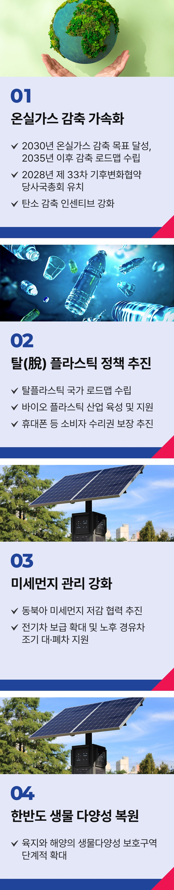

# 기후환경 공약

## 지구를 위한 환경공약
### 지구를 위한 약속, 지속가능한 대한민국으로 나아가겠습니다



```
지구를 위한 약속, 지속가능한 대한민국으로 나아가겠습니다
```

오늘은 55회 지구의 날입니다.

죽어가는 지구를 되살리고자 시작된 기념일이지만, 우리 현실은 우려스럽기만 합니다.

글로벌 비영리단체 기후행동네트워크(CAT)가 작년 11월 공개한 ‘기후변화대응지수(CCPI)'에서 우리나라는 67개국 중 63위였습니다.
산유국을 제외하면 꼴찌 수준입니다.

기후 위기는 모두의 생존 문제가 되고 있지만 시간이 갈수록 상황은 악화되고, 위기를 막을 시간도 줄어들고 있습니다.

“지구는 미래 세대에게 빌려온 것”이라는 말이 있습니다.

하나 뿐인 지구는 우리가 살고 있는 현재를 넘어, 우리 아이들과 미래에 영향을 미치기 때문입니다.

우리의 환경을 지키기 위해 지금 당장 할 수 있는 방안을 마련하겠습니다.
온실가스 감축으로 ‘기후 악당 국가’라는 오명을 벗겠습니다.

2030년 온실가스 감축목표를 달성하고,2035년 이후의 감축 로드맵도 빠르게 재정립 하겠습니다.

2028년 제33차 기후변화협약 당사국총회(COP33) 유치로 환경 분야에서도 세계에 모범이 되는‘K-이니셔티브’를 만들겠습니다.

국민이 참여하는 탄소 감축 실천에 대해 확실한 인센티브를 제공하겠습니다.

대한민국을 탈 플라스틱 선도 국가로 만들겠습니다.

먼저 국가차원의 탈플라스틱 로드맵을 수립하겠습니다.

말 그대로 '알맹이'만 팔아서 쓰레기를 줄이는 ‘알맹상점’처럼, 국민들이 자발적으로 만드는 순환 경제 거점 인프라를 지원하겠습니다.

중장기적으로 바이오 플라스틱 산업을 전략 육성하고, ‘소비자 수리권’보장으로 생활 속 자원순환 경제를 만들겠습니다.

미세먼지 없는 하늘을 국민께 돌려드리겠습니다.

2040년까지 석탄 발전을 폐쇄하고 전기차 보급 확대로 미세먼지를 획기적으로 줄이겠습니다.

일본, 중국 등 주변국과 미세먼지 저감을 위해 협력하겠습니다.

한반도 생물다양성을 회복하고 지키겠습니다.

산불 발생 지역 생물다양성 복원에 집중하겠습니다.

육지와 해양의 생물다양성 보호구역을 단계적으로 확대하고,국가생물다양성위원회의 기능을 대폭 강화하겠습니다.

오늘 저녁 저와 함께 우리 모두 10분간 불을 끄고 하늘의 별을 찾아봅시다.

이제부터 진짜 ‘지속가능한’ 대한민국,
오늘은 ‘지구를 지키는’ 이재명입니다.