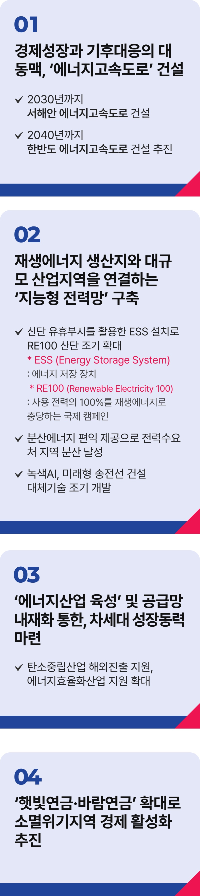

# 기후에너지(에너지고속도로) 공약

## 차세대 성장동력, '에너지고속도로'
### 에너지고속도로로 대한민국 경제도약과 지역균형발전을 이루겠습니다



```
에너지고속도로로
대한민국 경제도약과 지역균형발전을 이루겠습니다
```

해마다 극단적인 폭우와 가뭄, 산불로 인해 복구가 어려울 정도로 피해가 늘고 있습니다.

더 이상 이상기후가 아니라 ‘일상기후’가 된 것 아니냐는 우려 또한 높아지고 있습니다.

기후 위기 대응은 더 이상 선택의 문제가 아닙니다.

국제에너지기구(IEA) 자료(24.12월 기준)에 따르면, OECD 38개 회원국 중 우리나라의 재생에너지 발전 비중은 여전히 최하위
수준입니다.

2024년 기준으로 우리나라 에너지 비중은 원자력 31.7%, 석탄 28.1%, LNG 28.1%, 재생에너지 9.5%, 신에너지 1%입니다.

석탄 비중을 최소화하고 LNG 비중도 줄여가되, 재생에너지 비율을 신속히 늘려야 합니다.

### 전남·전북의 풍부한 풍력과 태양광으로 기후 위기에 대응하고, 경제도약을 위한 새로운 동력으로 만들겠습니다.

에너지 경쟁력이 곧 산업 경쟁력입니다.

기후 위기 대응과 지속 가능한 성장을 위해 재생에너지를 확대하고, 안정적인 에너지 공급 체계를 구축하겠습니다.

이를 통해 에너지 전환 선도 국가로 도약해야 합니다.

경제성장과 기후 대응의 대동맥, 에너지고속도로를 구축하겠습니다.

우리 기업들은 재생에너지 공급량이 부족해 EU 탄소국경조정제도나 글로벌기업에 적용되는 RE100에 제대로 대비하지 못했습니다.

전력망 부족으로 재생에너지 신규 보급조차 막힌 상황입니다.

거꾸로 도는 시계를 바로 잡겠습니다.

### 2030년까지 서해안 에너지고속도로를 건설하겠습니다.

20GW 규모의 남서해안 해상풍력을 해상 전력망을 통해 주요 산업지대로 송전하고, 전국에 RE100 산단을 확대하겠습니다.

2040년 완공 목표로 ‘U’자형 한반도 에너지고속도로 건설을 시작해 한반도 전역에 해상망을 구축하겠습니다.

이 프로젝트로 호남과 영남의 전력망을 잇고 동해안의 해상풍력까지 연결해 대한민국의 새로운 에너지 패러다임을 만들겠습니다.

지역에서 생산하고 지역에서 소비하는 분산형 에너지 체계를 만들겠습니다.

햇빛과 바람 에너지를 에너지저장장치(ESS), 그린수소, 히트펌프 등과 연계하고, AI기반 지능형 전력망을 활용하여 에너지 자립마을을
만들겠습니다.

전력 수요가 많은 기업들이 현재 수도권에 집중되어 있습니다.

분산 에너지 편익 제공과 인센티브 강화로, 이들 기업을 지역에 유치해 지역경제를 살리겠습니다.

재생에너지 생산지와 대규모 산업지역을 연결해 전국에 ‘RE100 산단’을 조성하겠습니다.

### 재생에너지와 탄소중립산업을 대한민국 경제를 책임질 ‘제2의 반도체 산업’으로 만들겠습니다.

2024년 기준, 전 세계 에너지 부문 투자액은 4,360조 원에 달합니다.

반도체와 자동차 시장을 합한 것보다 규모가 큽니다.

에너지고속도로를 마중물 삼아, 재생에너지, 전력망, ESS 산업 경쟁력을 키우겠습니다.

히트펌프, 그린수소 등 탄소중립산업을 지원하고 전기차, 이차전지 등 연계산업에 집중적으로 투자하겠습니다.

에너지산업을 지역균형발전의 핵심으로 키우고, 대한민국을 대표하는 산업으로 만들겠습니다.

### 선박, 건설 중장비, 농기계 등의 전동화도 서둘러 대한민국 제조업의 지속 가능한 성장을 이끌겠습니다.

햇빛·바람 연금을 확대해 소멸 위기 지역의 경제를 살리겠습니다.

전남 신안군은 수년 전부터 태양광 발전소를 통해 주민들에게 총 220억 원을 배당했습니다.

2032년이면 1인당 연 600만 원 배당도 가능합니다.

이런 성과 덕분에 신안군은 인구 소멸 위기 지역 중 유일하게 인구가 늘고 있습니다.

‘햇빛‧바람 연금’을 전국으로 확대해 주민 소득을 늘리고, 사람이 돌아오는 지역으로 만들겠습니다.

김대중 대통령은 ‘정보화고속도로’로 IMF 경제위기를 극복하셨습니다.

저 이재명은 ‘에너지고속도로’로 세계를 주도하는 K-이니셔티브 시대를 열겠습니다.

이제부터 진짜 대한민국입니다.

지금은 이재명입니다.