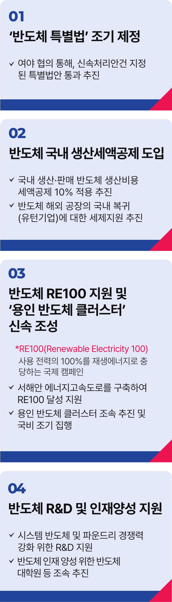

# 반도체 공약

## K-반도체 대도약 실현
### 압도적 초격차·초기술로 세계 1등 반도체 국가를 만들겠습니다



```
압도적 초격차·초기술로
세계 1등 반도체 국가를 만들겠습니다
```

2024년 우리나라 반도체 수출액은 204조 원(1,419억 달러)으로 전체 수출액(983조 원)의 20%를 차지했습니다.

그러나 지금, 대한민국 경제성장의 핵심 엔진이던 반도체가 위기를 맞고 있습니다.

글로벌 공급망 리스크에 치열해진 AI 반도체 경쟁까지 더해져 이중, 삼중의 위기에 포위된 것입니다.

오늘날 글로벌 경제 패권은 바로, 누가 반도체를 지배하느냐에 달려 있습니다.

우리에게 ‘반도체를 지킨다’는 말은 ‘우리 미래를 지킨다’는 의미입니다.

### 반도체 특별법을 신속하게 제정하겠습니다

미국과 일본, EU가 서로 경쟁적으로 반도체 지원정책을 발표하고 있습니다.

반도체 경쟁력을 확대하기 위해서는 국가 차원의 지원과 투자가 필수적입니다.

하지만 우리 반도체 특별법은 정부 여당의 몽니로 국회를 통과하지 못했습니다.

반도체 특별법 제정으로 기업들이 반도체 개발·생산에 주력할 수 있게 하겠습니다.

### 반도체에 대한 세제 혜택을 넓히겠습니다.

반도체는 대표적인 자본집약적 산업입니다.

막대한 투자비용이 들뿐 아니라 일단 격차가 생기면 따라잡기 어렵습니다.

정부가 길을 내서 기업들이 잘 달릴 수 있게 만들어야 합니다.

국내에서 생산·판매되는 반도체에는 최대 10% 생산세액공제를 적용해 반도체 기업에 힘을 실어주겠습니다.

또한 반도체 기업의 국내 유턴을 지원해 공급망 생태계도 강화하겠습니다.

### 반도체 RE100 인프라를 구축하고 용인 반도체 클러스터를 신속하게 조성하겠습니다.

작년 미국 에너지경제·재무분석 연구소는 우리나라의 재생에너지 부족이 반도체 경쟁력을 훼손할 것이라고 경고했습니다.

2030년까지 서해안 에너지고속도로를 완공해 반도체 기업들의 RE100 달성을 지원하겠습니다.

용인 반도체 클러스터도 조성을 서둘러 세계에 자랑할 수 있는 스마트그린 반도체단지를 만들겠습니다.

### 반도체 R&D와 인재 양성을 전폭적으로 지원해 압도적 초격차 기술을 확보하겠습니다.

우리나라가 우위를 점하고 있는 메모리 반도체 외에도 시스템반도체와 파운드리 경쟁력 제고를 위해 R&D 지원 및 반도체 대학원 등 고급 인력 양성
인프라를 조기에 구축하겠습니다.

반도체의 전설로 꼽히는 앤디 그로브는 “위기가 닥쳤을 때 나쁜 기업은 망하고, 좋은 기업은 살아남지만, 위대한 기업은 더욱 발전한다”고 말했습니다.

대한민국을 위대한 반도체 강국으로 만들겠습니다.

이제부터 진짜 대한민국입니다.

지금은 이재명입니다.