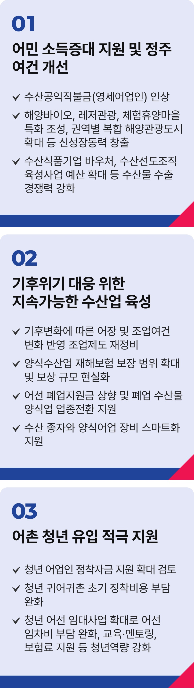

# 어업활성화

## 살기좋은 어촌, 활기찬 어촌



```
어촌을 미래로 나아갈 기회의 장으로 만들겠습니다
```

어촌 소멸 위기가 빨라지고 있습니다.

청년이 떠난 어촌에는 일할 사람이 부족합니다. 기후 위기가 바다 생태계를 바꾸며, 어민들의 삶터를 위협하고 있습니다.

‘살기 좋은 어촌’, ‘활기찬 어촌’으로 나아가기 위한 특단의 대책이 필요합니다. 어민의 삶을 지키고, 우리 수산업의 지속가능성을 확보해야 합니다.

### 첫째, 어민 소득 증대와 정주 여건 개선을 추진하겠습니다.

영세어업인에게 지급하는 수산공익직불금 인상을 추진해 소득 안정을 지원하겠습니다.

수산식품 기업바우처와 수산선도조직 육성사업 예산을 확대해 우리 수산물의 수출경쟁력을 높이겠습니다.

가공설비와 수산물 자조금 지원을 강화해 K-Seafood 수출 확대를 뒷받침하겠습니다.

해양바이오 산업을 키우고, 레저관광 산업을 확대해 어촌의 새로운 성장동력으로 만들겠습니다.

권역별 복합 해양관광도시를 확대하고, 마리나 거점 및 레저선박 클러스터를 조성하겠습니다.

어촌 체험·휴양마을 특화 조성을 확대하고, 어촌 자원을 활용한 창업을 지원해 지역 경제를 되살리겠습니다.

### 둘째, 기후위기에 대응해 지속가능한 수산업을 육성하겠습니다.

기후변화에 따른 어장 및 조업 여건 변화에 유연하게 대응하는 시스템을 구축하겠습니다.

양식수산업 재해보험 보장 범위를 넓히고, 보상 규모 현실화도 추진하겠습니다.

어선 폐업지원금 인상을 추진하고, 폐업하는 수산물 양식업자의 업종 전환 지원도 확대하겠습니다.

수산 종자와 양식어업 장비 스마트화를 지원하고, 필수 수산 양식 기자재 보급에 대한 정부 지원도 추진하겠습니다.

### 셋째, 어촌 청년 유입을 적극 지원하겠습니다.

청년의 안정적인 정착을 돕는 어촌정착지원 사업을 개선하겠습니다. 지원 대상을 넓히고, 정착 지원액 인상도 검토하겠습니다.

어선 임대 사업을 확대해 초기 정착 비용인 어선 임차비 부담을 낮추겠습니다.

어구 구입비 지원과 어선·어업 교육, 멘토링, 보험료 지원 등 청년 역량 강화도 함께 추진하겠습니다.

바다는 어민의 삶의 터전이며, 대한민국이 미래로 뻗어 나갈 희망의 보고입니다.

어촌에 새로운 활력을 불어넣고, 어민의 삶을 든든히 받치겠습니다. 어촌을 대한민국의 내일을 여는 기회의 땅으로 만들겠습니다
이제부터 진짜 대한민국, 지금은 이재명입니다.