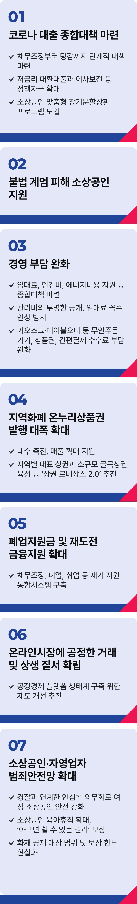

# 소상공인·자영업자

## 우리 경제의 뿌리, 소상공인‧자영업자



```
소상공인‧자영업자의 부담은 줄이고, 매출은 늘리는 나라를 만들겠습니다
```

소상공인·자영업자가 생존 위기에 몰렸습니다. 코로나와 3고(고물가, 고금리, 고환율), 끝 모를 내수 부진까지 견뎠지만, 불법 내란 사태로 직격탄을
맞았습니다. 민생의 중심이 무너지고 있습니다.

원자잿값은 치솟고, 소비도 줄고 있습니다. 장사는 안되고, 이자 감당도 어렵습니다. 자영업자의 빚은 코로나 이전보다 380조 원 늘었고, 취약차주만
43만 명에 이릅니다.

우리 경제의 뿌리인 소상공인과 자영업자를 확실히 살리겠습니다. 금융과 경영 부담을 낮추고, 마음 편히 일하며 장사할 수 있는 나라를 만들겠습니다.

### 첫째, 코로나 대출 종합대책을 마련하겠습니다.

코로나 시기 국가가 나눠졌어야 할 책임을 소상공인과 자영업자에게 떠넘긴 건 부당합니다. 채무조정부터 탕감까지 특단의 대책을 단계적으로
추진하겠습니다. 저금리 대환대출과 이차보전 등 정책자금 확대, 소상공인 맞춤형 장기분할상환 프로그램을 도입하겠습니다.

### 둘째, 불법 계엄 피해 소상공인을 지원하겠습니다.

내란 사태로 소비가 위축되고, 피해는 고스란히 소상공인·자영업자 몫이었습니다. 피해 회복을 위한 비용을 공동체가 함께 분담하겠습니다.

### 셋째, 경영 부담을 대폭 덜어드리겠습니다.

임대료, 인건비, 에너지비용 지원 등 부담을 낮추는 종합대책을 마련하겠습니다. 관리비를 투명하게 공개해 임대료 꼼수 인상을 막겠습니다.

키오스크·테이블오더 등 무인주문기기와 상품권, 간편결제 수수료 부담도 완화하겠습니다.

### 넷째, 지역화폐와 온누리상품권을 확대하겠습니다.

발행 규모를 대폭 확대해 내수를 촉진하고 매출을 키우겠습니다. 지역별 대표상권과 소규모 골목상권을 키우는 상권르네상스 2.0으로 지역경제에
활기를 불어넣겠습니다.

### 다섯째, 폐업지원금을 확대하고 재도전을 지원하겠습니다.

폐업비용과 대출 일시 상환 부담 때문에 다시 빚을 내는 악순환을 반드시 끊겠습니다. 폐업지원금을 늘리고, 재도전 금융지원을 확대하겠습니다.

채무조정부터 폐업, 취업까지 재기를 지원하는 통합 시스템을 구축하겠습니다.

### 여섯째, 온라인시장에 공정한 거래와 상생의 질서를 세우겠습니다.

온라인플랫폼의 과도한 수수료와 광고비 요구 등 불공정거래 행위가 증가하고 있습니다. 공정경제 플랫폼 생태계 구축을 위한 제도 개선을
추진하겠습니다.

### 일곱째, 소상공인 범죄 안전망을 더 두텁게 만들겠습니다.

지방경찰청과 연계한 안심콜을 의무화해 여성 소상공인을 범죄로부터 지키겠습니다. 소상공인 육아휴직수당을 확대하고, ‘아프면 쉴 권리’를
보장하겠습니다. 화재공제 대상 범위와 보상한도를 현실화해 더 안전한 가게를 만들겠습니다.

소상공인이 살아야 민생이 살고, 경제도 살아납니다. 고물가와 장기 내수 부진에 지친 소상공인·자영업자들에게 부담은 줄이고, 매출은 올릴 수 있는
환경을 만들겠습니다.

이제부터 진짜 대한민국,
지금은 이재명입니다.