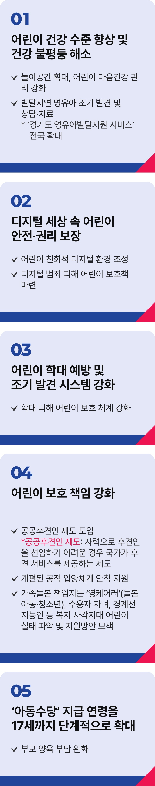

# 어린이 정책

## 어린이가 존중 받는 나라



```
어린이가 존중받는 나라, 아이들이 행복한 대한민국을 만들겠습니다
```

해맑은 아이들의 웃음이 온 세상을 미소 짓게 하는 어린이날입니다. 아이들의 환한 웃음 앞에서 더 나은 세상을 만들겠다는 다짐을 합니다.

‘어린이’라는 단어에는 사랑은 물론 존중의 의미가 담겨있습니다. 아이들의 인권과 인격을 온전히 존중해야 합니다.

모든 어린이가 건강하게 자랄 권리를 보장하겠습니다. 아이들의 건강 수준을 높이고, 건강 격차를 줄이겠습니다.

놀이시간과 공간을 확대해, 몸 건강뿐 아니라 마음 건강까지 살피겠습니다.

저는 경기도지사 시절 발달지연 영유아를 조기에 발견해 상담과 치료를 받을 수 있도록 하는 ‘경기도 영유아 발달지원 서비스’를 도입한 바
있습니다. 이를 전국으로 확대하겠습니다.

디지털 세상이 발전할수록 디지털 범죄 피해가 늘고 있습니다. 아이들의 눈높이에 맞춘 아동 친화적 디지털 환경을 만들어, 아이들의
권리를 최대한 확보하겠습니다.

우리 아이들이 디지털 범죄로부터 피해 입지 않도록 최선의 보호책을 마련하겠습니다.

아동학대를 예방하고 신속하게 발견할 수 있도록 시스템을 개선하고, 피해 아동 보호 체계도 더욱 두텁게 하겠습니다.

공공후견인 제도를 도입하고, 개편된 공적 입양체계도 안착할 수 있도록 적극 지원하겠습니다.

가족 돌봄을 책임지고 있는 영케어러(돌봄아동), 수용자 자녀, 경계선 지능인 등 소외된 아이들의 실태를 파악하여 빈틈없는 지원방안을
모색하겠습니다.

아동수당 지급 연령을 18세 미만까지 단계적으로 확대해, 부모의 양육부담을 줄이겠습니다.

우리 아이들이 꿈꿀 수 있는 세상, 어린이의 웃음소리가 계속될 수 있는 나라를 위해 어른의 책임을 다하겠습니다.

아동 권리 보장! 아동 보호 강화!
이제부터 진짜 대한민국,