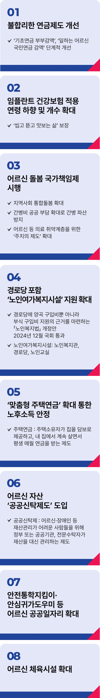

# 어르신 정책

## 어르신이 행복한 나라!



```
어르신이 행복한 나라,
이재명이 만드는 진짜 대한민국입니다
```

대한민국은 전쟁의 상흔을 이겨내고 세계 10위권 경제강국, 세계 5위의 군사강국으로 도약했습니다.

그 기반에는 어르신들의 헌신과 피땀이 있었습니다.

하지만 산업화를 이끈 부모 세대, 어르신들이 거리에서 폐지를 주으며 생계를 걱정하십니다.

나라는 선진국이라 자부하면서도 그 발전이 개개 국민의 삶으로 이어지지 않다보니 삶의 형편이 여전히 제자리에 머물고 있는 것입니다.

자랑스러운 역사를 만든 어르신들께서 건강하고 행복한 노후를 누릴 수 있도록, 국가가 제대로 보답해야 합니다.

기초연금 부부감액을 단계적으로 줄이겠습니다. 어르신 부부가 좀 더 여유롭게 지내시도록 돕겠습니다.

일하는 어르신 국민연금 감액도 개선하겠습니다. 오히려 100세 시대 어르신이 일하실 수 있도록 권장하는 것이 맞습니다.

임플란트 건강보험 적용 연령은 낮추고, 개수는 늘려가겠습니다.

어르신 돌봄 국가책임제를 시행하겠습니다. 지역사회가 함께 돌보는 통합돌봄을 확대해 어르신이 동네에서 편하게 돌봄을 받게
하겠습니다.

간병비 부담을 개인이 아닌 사회가 함께 나누겠습니다. 공공이 부담을 나누어 간병파산의 걱정을 덜어드리겠습니다.

어르신 등 의료 취약계층을 위한 '주치의제도'도 확대하겠습니다.

작년 말, 민주당이 주도한 ‘경로당 주 5일 급식 지원’ 법안이 국회에서 통과됐습니다. 경로당은 물론, 노인여가복지시설에 대한 지원을
확대하겠습니다.

‘맞춤형 주택연금’을 확대해 노후소득을 안정시키고, 재산 관리가 어려운 어르신을 위한 공공신탁제도를 도입하겠습니다.

안전통학지킴이, 안심귀가도우미 같은 공공일자리를 늘리고, 어르신 체육시설도 더 많이 만들겠습니다.

어르신 한 분, 한 분이 바로 우리 대한민국의 역사입니다.

이제는 가난과 외로움이 아니라 헌신과 노력에 대한 정당한 대우가 필요합니다. 어르신의 노후를 국가가 책임지는 사회가 진짜
선진국입니다.

이제부터 진짜 대한민국,
지금은 이재명입니다.