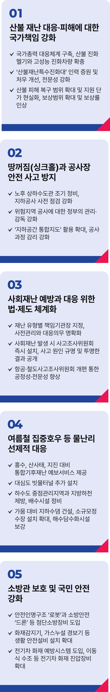

# 재해·재난 정책

## 안전한, 국민의 삶!
### 재해·재난 위험으로부터 국민의 삶을 지키는 진짜 대한민국을 만들겠습니다



```
재해·재난 위험으로부터 국민의 삶을 지키는 진짜 대한민국을 만들겠습니다
```

기후위기에 따른 자연재난과 대형 화재, 땅꺼짐 사고 등 사회재난이 이어지고 있습니다. 재해·재난은 언제든, 어디서든 발생할 수 있습니다.

재해‧재난으로부터 국민의 생명과 안전을 지키는 일은 국가의 제1책무입니다.

국민이 안전하고 평안하며 행복한 삶을 누릴 수 있도록 더 큰 책임을 다하겠습니다.

### 첫째, 산불 재난 대응과 피해에 대한 국가책임을 강화하겠습니다.

기후 위기가 심화되며 산불이 잦아지고 규모도 커지고 있는 만큼, 국가가 적극적으로 대응해야 합니다.

국가 총력 대응체계를 구축하고, 산불진화헬기와 고성능 진화차량을 확충하겠습니다.

산불재난특수진화대는 인력을 늘리고, 처우를 개선하며, 전문성을 강화하겠습니다.

피해 주민의 신속한 일상 회복을 지원하겠습니다.

재해대책의 피해 복구 범위를 확대하고, 지원단가를 현실화하겠습니다. 어쩔 수 없는 재해로 인한 피해에 대해서는 보험료 인상이 되지 않도록
개선하겠습니다.

보상 범위 확대와 보상률 인상도 추진하겠습니다.

### 둘째, 땅꺼짐 사고(싱크홀)와 공사장 안전사고 방지에 최선을 다하겠습니다.

지하안전관리 점검의 국가책임을 강화하겠습니다.

노후 상하수도관은 조기 정비하고, 지하 공사에 대한 사전 점검을 강화하겠습니다. 위험지역 공사는 중앙정부의 관리·감독을 강화하겠습니다.

지하 구조물 정보를 담은 ‘지하공간 통합지도’ 활용을 확대해 위험지역을 조기에 발견하고, 공사 과정의 감리활동을 강화해 사고를 예방하겠습니다.

### 셋째, 사회재난 예방과 대응 관련 법‧제도를 체계화하겠습니다.

재난 유형별 책임기관장을 지정하고 사전 관리와 대응 의무를 명확히 하겠습니다. 부처 간 협업 체계를 구축해 통합 대응 역량을 높이겠습니다.

사회재난 발생 시 사고조사위원회를 즉시 설치해 원인을 철저히 규명하고, 결과는 투명하게 공개하겠습니다.

항공철도사고조사위원회를 개편해 항공 참사 등 대형 사고의 조사 공정성과 전문성을 높이겠습니다.

### 넷째, 여름철 집중호우 등 물난리에 선제적으로 대응하겠습니다.

홍수‧산사태‧지진에 대비한 통합기후 재난예보 서비스를 제공하고, 예보 역량을 강화하겠습니다.

도시침수를 막기 위해 대심도 빗물터널을 추가 설치하고, 하수도 중점 관리지역과 지방하천 제방, 배수시설을 정비하겠습니다.

가뭄 대응을 위한 지하수댐 건설과 소규모정수장 설치 확대, 해수담수화시설을 보강하겠습니다.

### 다섯째, 소방관을 보호하고, 국민 안전을 강화하겠습니다.

소방관이 안전해야 국민이 안전합니다. 안전인명구조로봇과 소방안전드론 등 첨단 소방장비 도입을 확대해 소방관의 안전을 강화하겠습니다.

화재감지기, 가스누설 경보기 등 생활 안전설비 설치를 늘리고, 국가 지원도 확대하겠습니다.

전기차 화재 예방 시스템을 도입하고, 이동식 수조 등 전기차 화재 진압장비도 확대하겠습니다.

국가는 국민의 생명과 안전, 그리고 더 나은 삶을 위해 존재합니다.

국민의 생명과 안전을 지키는 데 ‘과잉 대응’이란 없습니다.

국민이 불안해하지 않는 나라, 재난을 당해도 다시 일어날 수 있는 대한민국을 만들겠습니다.

이제부터 진짜 대한민국, 지금은 이재명입니다.