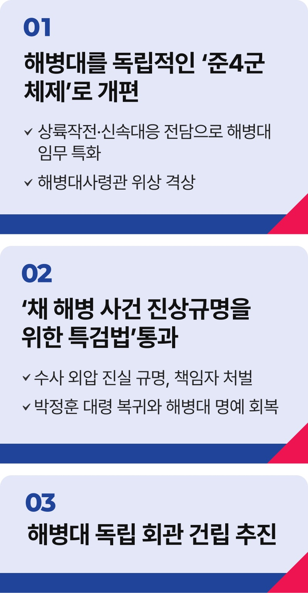

# 해병대 정책

## 무적 해병을 K-국방강국의 선봉에 세우겠습니다



```
무적해병을 K-국방강국의 선봉에 세우겠습니다
```

해병대는 창군 이래 한결같이 대한민국 안보의 최전선을 지켜왔습니다. 해병대원이 자부심을 느끼고, 해병대의 명예가 존중받는 K-국방강국을
만들겠습니다.

‘채 상병 사건 진상규명을 위한 특검법’을 반드시 통과시키겠습니다.

실추된 해병대의 명예를 바로 세우고, 불법 권력에 맞서 수사의 소임을 다한 박정훈 대령이 반드시 제자리로 돌아올 수 있게 하겠습니다.

외압의 진실은 끝까지 밝히고, 책임자는 반드시 처벌받게 하겠습니다.

해병대를 독립적인 ‘준4군 체제’로 개편하고 해병대사령관의 위상을 격상하겠습니다.

해병대 임무를 상륙작전‧신속대응 전담으로 특화하고, 현 해병대 임무 중 해안과 강안 경계 작전 임무는 최첨단 감시체계를 갖추도록 지원하겠습니다.

해병대 독립 회관 건립을 추진하겠습니다.

현재 각 군 중 해병대만 독립 회관이 없습니다. 전우애를 기리고 전통을 계승할 회관을 건립해 해병의 자긍심을 세우겠습니다.

21세기 미래 전장에서 승리하는 무적의 스마트 강군,
그 선봉에 해병대를 세우겠습니다.

해병대가 국민의 신뢰를 등에 업고, 대한민국 안보를 든든히 책임지도록 확고한 기반을 마련하겠습니다.

이제부터 진짜 대한민국, 지금은 이재명입니다.