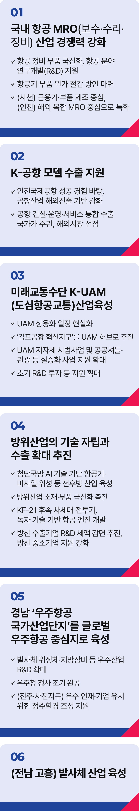

# 항공·방위· 우주산업 정책

## 항공·방위·우주산업을 대한민국의 미래 성장동력으로 만들겠습니다



```
항공‧방위‧우주산업을 대한민국의 미래 성장동력으로 만들겠습니다
```

한국형 전투기(KF-21)가 하늘을 지키고, 인천공항은 동북아를 대표하는 글로벌 허브로 도약했습니다. 누리호 발사 성공으로 우리는 세계 7번째 자력
위성 발사국이 되었습니다.

항공‧방위‧우주산업은 부가가치가 높고, 좋은 일자리를 만드는 첨단 미래산업의 대표적인 핵심산업입니다. 대한민국을 항공·방위‧우주산업 강국으로
만들겠습니다.

민간과 방위산업이 함께 키운 ‘하늘길’ 산업을 더욱 발전시키고, 우주로 확장해 새로운 성장의 기회를 열겠습니다.

### 첫째, 국내 항공 MRO(보수‧수리‧정비) 산업의 경쟁력을 키우고, 부품‧ 정비‧공항서비스 등 고부가가치 산업을
육성하겠습니다.

항공정비 부품은 국산화하고, 항공 분야 연구개발(R&D)을 지원해 기술역량을 높이겠습니다.

국제협약 가입이나 관세법 개정 등으로 항공기 부품 원가를 낮추는 방안을 마련하겠습니다.

사천은 군용기와 부품 제조 중심으로 인천은 해외 복합 MRO 중심으로 특화해, 두 도시를 세계적인 MRO 산업 거점으로 키우겠습니다.

### 둘째, K-공항 모델 수출을 전폭 지원하겠습니다.

인천국제공항의 성공 경험을 바탕으로 우리 공항산업의 해외 진출 기반을 다지겠습니다. 공항의 건설부터 운영, 서비스까지 통합 수출할 수 있도록
국가가 주관하고, 전문기업으로 구성된 컨소시엄을 구성해 해외 시장을 선점하겠습니다.

### 셋째, 미래 교통수단 K-UAM(도심항공교통)산업을 육성하겠습니다.

이전 정부에서 보여주기에 그쳤던 K-UAM의 상용화 일정을 현실화하고, 사업 추진에 속도를 내겠습니다.

‘김포공항 혁신지구’를 UAM 허브로 적극 추진하고, K-UAM 지자체 시범사업과 공공셔틀‧관광‧공공 실증화 사업에 대한 국가 지원도 확대하겠습니다.

초기 R&D 투자 등 지원을 확대해 K-UAM 산업이 세계시장을 선도하도록 만들겠습니다.

### 넷째, 방위산업의 기술 자립과 수출 확대를 추진하겠습니다.

첨단 국방 AI 기술 기반을 구축해 항공기, 미사일, 위성 등 전후방 산업을 육성하고, 방위산업 소재‧부품 국산화를 촉진해 기술 자립도를 높이겠습니다.

KF-21 후속 차세대 전투기와 독자 기술 기반의 항공기 엔진을 개발해 자주국방을 실현하겠습니다.

방위산업 수출기업에는 R&D 세액 감면을 추진해 기업경쟁력을 확보하고, 방위산업 중소기업 지원도 강화해 수출 시장을 다변화하겠습니다.

### 다섯째, 경남 우주항공국가산업단지를 글로벌 우주항공 중심지로 키우겠습니다.

발사체, 위성체, 지상장비 등 우주산업 전반의 R&D를 대폭 확대해 선진국 수준의 기술력을 확보하겠습니다.

우주청 청사는 조기에 완공하고, 진주와 사천지구에 우수 인재와 기업이 모일 수 있도록 정주환경 조성을 적극 지원하겠습니다. 고흥의 발사체 산업도
더욱 발전시키겠습니다.

故김대중 대통령님의 결단으로 시작된 보라매 사업은 한국형 전투기 KF-21로 대한민국의 하늘을 지키고 있습니다.

무한한 가능성이 펼쳐진 우주에서도, 진짜 대한민국이 세계를 선도해야 합니다.

하늘길을 연 결단을 이어, 우주로 향하는 새로운 길을 열겠습니다.

이제부터 진짜 대한민국, 지금은 이재명입니다.