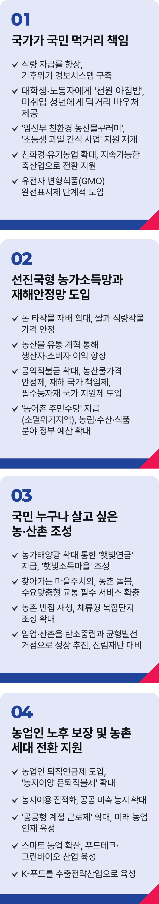

# 농림·축산·식품분야 정책

## 농업인이 존중받고 농‧산촌이 행복한 진짜 대한민국을 만들겠습니다



```
기후 위기 시대, 국가가 먹거리를 책임지고
누구나 살고 싶은 행복한 농촌을 만들겠습니다
```

농업은 이제 더 이상 1차 산업이 아닙니다.

식량주권을 지키고 국가안보를 책임지는 전략산업입니다.

농촌은 에너지 전환과 균형발전을 이끄는 새로운 거점으로 변화해야 합니다.

하지만 기후 위기로 식량안보는 위협받고, 수급 불안까지 겹치며 농업의 지속 가능성이 흔들리고 있습니다.

기후농정으로 철저히 대응하겠습니다.

농업인이 가격 걱정, 재해 걱정 없이 농사짓는 안심농정을 실현하겠습니다.

국민 누구나 살고 싶은 농촌을 만들겠습니다.

### 첫째, 기후위기 시대, 국민의 먹거리는 국가가 책임지겠습니다.

식량 자급률을 높이고, 위기 경보 시스템을 구축해 기후 위기에 선제적으로 대응하겠습니다.

기후변화에 강한 ‘기후적응형 농업’을 추진하겠습니다.

대학생과 노동자에게 ‘천원의 아침밥’을, 미취업 청년에겐 먹거리 바우처를 제공하겠습니다.

‘임산부 친환경 농산물꾸러미’, ‘초등학생 과일 간식 사업’의 국가 지원도 재개하겠습니다.

친환경‧유기농업을 확대하고, 환경과 조화되는 지속가능한 축산업으로 전환을 지원하겠습니다.

유전자변형식품(GMO) 완전표시제를 단계적으로 도입해 소비자의 알권리와 선택권을 보장하겠습니다.

### 둘째, 선진국형 농가소득을 보장하고 재해안전망을 도입하겠습니다.

양곡관리법을 개정해 논 타작물 재배를 늘리고, 쌀과 식량작물 가격을 안정시키겠습니다.

농산물 유통을 개혁해 생산자와 소비자 모두에게 이익이 돌아가는 구조로 바꾸겠습니다.

공익직불금을 확대하고, 농산물가격 안정제 · 재해 국가 책임제 · 필수농자재 국가 지원제를 도입하겠습니다.

농어촌주민수당을 지급하고, 농림‧수산‧식품 분야 정부 예산도 확대하겠습니다.

### 셋째, 누구나 살고 싶은 농산촌을 만들겠습니다.

농가 태양광을 확대해 ‘햇빛연금’을 지급하고, 주민이 주도하는 ‘햇빛소득마을’을 조성하겠습니다.

찾아가는 마을주치의, 생활 서비스, 농촌 돌봄, 수요맞춤형 교통 등 필수 서비스를 확충하겠습니다.

농촌 빈집은 재생해 새롭게 단장하고, 체류형 복합단지는 더 많이 조성하겠습니다.

임업과 산촌은 탄소중립과 균형발전의 주요 산업이자 거점으로 키우겠습니다.

산림재난에 철저히 대비해 국민의 생명과 재산을 지키겠습니다.

### 넷째, 노후를 보장하고, 세대를 잇는 농업으로 바꾸겠습니다.

농업인 퇴직연금제를 도입하고, ‘농지이양 은퇴직불제’를 확대해 안정적인 세대교체를 추진하겠습니다.

농생명 용지를 조기 개발하고, 농지 이용 집적화, 공공 비축 농지 확대 등 농지제도를 혁신하겠습니다.

‘공공형 계절 근로제’를 확대해 농촌 일손 부족 문제를 해결하겠습니다.

청년과 여성, 농업 전문인력, 공동 영농조직 등 미래 농업 인재를 체계적으로 키우겠습니다.

스마트농업을 확산하고, 푸드테크와 그린바이오 산업을 육성하겠습니다.

K-푸드를 수출전략산업으로 키워 농식품 강국으로 도약하겠습니다.

대한민국이 세계 10대 경제 대국으로 성장하기까지,
그 뿌리에는 농업인의 땀과 눈물,
그리고 헌신이 있었습니다.

이제는 국가가 책임 있는 농정으로 응답하겠습니다.

농업을 균형발전과 식량안보를 이끄는 국가 전략산업으로 키우겠습니다.

기후 위기에 대응하는 지속가능한