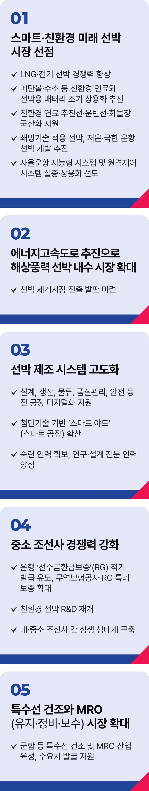

# 조선 산업 정책

## K-조선업으로 해양강국을 만들겠습니다



```
K-조선업으로 해양강국을 만들겠습니다
```

조선업은 대한민국 수출을 이끌고 일자리를 만들어온 핵심 산업입니다. 특히, 세계 1, 2위를 다투는 선박 건조 능력은 대한민국의
자부심입니다.

하지만 우리 조선업이 대전환의 갈림길에 놓였습니다. 기후 위기와 디지털 전환이라는 거대한 흐름 속에서, 조선업이 한 단계 더
도약하려면 지속 가능한 성장전략이 절실합니다. 저 이재명은 조선업 미래 발전 5대 전략으로, 조선강국을 넘어 세계를 선도하는
해양강국을 만들겠습니다.

### 첫째, 스마트‧친환경 미래 선박 시장을 선점하겠습니다.

작년 한 해 해외로부터 선박 신규 주문 절반은 친환경 선박이었습니다. 자동차와 마찬가지로 세계 선박 시장도 탄소배출 절감이
요구되면서 점차 친환경이 주류를 이루게 되었습니다.

LNG 선박과 전기선박의 경쟁력을 높이고, 메탄올‧암모니아‧수소 등 친환경 연료와 선박용 배터리의 조기 상용화를 이끌겠습니다.

친환경 연료 추진선과 운반선, 화물창 국산화 등 초격차 원천기술 개발도 적극 지원하겠습니다.

쇄빙기술 적용 선박과 저온‧극한 운항 선박을 개발해 북극항로 중심국가로 도약을 추진하겠습니다.

자율운항 지능형 시스템 실증 지원과 원격제어 시스템 상용화로 스마트 선박 시장을 선도하겠습니다.

### 둘째, ‘에너지고속도로’로 풍력 선박 시장을 열겠습니다.

앞으로 10년간 글로벌 해상풍력 시장은 5배 이상 성장할 전망입니다.

해상풍력설치선(WTIV)‧유지보수지원선(CSOV)‧해저케이블설치선(CLV) 등 관련 선박 수요도 급증할 것으로 예상됩니다.

에너지고속도로 프로젝트를 조기에 추진해 해상풍력 선박의 내수 시장을 키우고, 동시에 세계 시장 진출의 발판도 마련하겠습니다.

### 셋째, 선박 제조 시스템을 고도화하겠습니다.

설계부터 생산, 물류, 품질관리, 안전까지 전 공정의 디지털화를 지원하겠습니다.

AI와 로봇으로 자동화율과 생산성을 높이고, 작업자들의 안전을 강화하겠습니다.

첨단 기술 기반의 ‘스마트 야드(스마트 공장)’를 조선소 전반으로 확산하겠습니다.

숙련 인력 확보와 함께, 연구‧설계 전문 인력 등 맞춤형 인력 양성을 적극 뒷받침하고, 처우도 개선하겠습니다.

### 넷째, 중소 조선사의 경쟁력을 키우겠습니다.

은행의 선수금환급보증(RG)이 적기에 발급되도록 유도하고, 무역보험공사의 RG 특례보증도 확대해 수주 활동을 뒷받침하겠습니다.

윤석열 정부가 중단한 중소 조선사의 친환경 선박 R&D를 재개해 든든한 버팀목을 만들겠습니다.

대·중소 조선사 간 상생할 수 있는 생태계를 조성해 중소조선과 조선기자재 동반 수출 등 시너지 효과를 극대화하겠습니다.

### 다섯째, 특수선 건조와 MRO(유지‧보수‧정비) 시장을 새로운 성장동력으로 키우겠습니다.

상선은 물론 군함을 포함한 초거대 MRO 시장은 K-조선업의 새로운 기회입니다.

특수목적선 선진화와 특수선 MRO 산업을 적극 육성하고, 수요처 발굴을 지원해 조선산업의 미래를 열겠습니다.

K-이니셔티브 주요 자산인 조선업이 지속가능하게 성장하도록 기반을 구축하겠습니다. K-조선업이 대한민국의 성장을 이끌고, 다시금
지역경제의 든든한 주축으로 우뚝 설 수 있도록 하겠습니다.

이제부터 진짜 대한민국입니다.

지금은 이재명입니다.