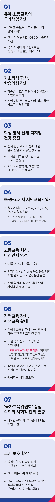

# 교육 정책

## 교육의 국가 책임 강화!
### 모두가 안전하고 행복한 학교를 만들겠습니다



```
교육의 국가 책임을 강화해
모두가 안전하고 행복한 학교를 만들겠습니다
```

옛말에 ‘일 년 계획으로 곡식을 거두고, 십 년을 계획해 나무를 키우고, 평생을 계획해 사람을 기른다’고 했습니다. 훌륭한 인재를 기르기는
무척 어렵고 오래 걸리는 일이기에, 교육을 백년대계(百年大計)라 하며 국가의 근본사업이라 한 것입니다.

자원도 자본도 없던 대한민국이 기술 선진국으로 도약할 수 있었던 힘은 바로 교육에 있었습니다. 다시 한 번 그 힘을 발휘해 내일의 기회로
이어가겠습니다. 신뢰받는 공교육, 미래를 여는 교육 혁신으로 K-교육을 완성하겠습니다.

### 첫째, 유아·초등교육의 국가 책임을 강화하겠습니다.

유아교육‧보육비 지원을 5세부터 단계적으로 확대하겠습니다. 교사 대 아동 비율을 OECD 수준까지 단계적으로 낮추고, 더 세심하고
안전한 교육환경을 만들겠습니다. 국가와 지자체, 학교가 함께하는 ‘온동네 초등돌봄’으로 질 높은 돌봄교육을 제공하겠습니다.

### 둘째, 학생들의 기초학력을 높이고 학습역량을 강화하겠습니다.

학습 결과가 잠재력에 미치지 못하는 ‘학습결손’을 조기에 발견해, 지원이 필요한 학생에게 전문 교사의 개별지도를 확대하겠습니다. 지역
곳곳에 ‘자기주도학습센터’를 설치해 사교육비 부담도 줄이겠습니다.

### 셋째, 학생의 정서와 신체, 디지털 건강을 돌보겠습니다.

정서와 행동 문제로 어려움을 겪는 학생(정서‧행동 위기학생)에게 검사부터 상담, 치료까지 이어지는 맞춤형 지원을 제공하겠습니다.

디지털에 지나치게 의존하는 청소년을 위한 지원 프로그램도 운영하겠습니다. 체육교육을 활성화하고, 체험학습 안전관리도
전문화하겠습니다.

### 넷째, 초·중·고 학교에서 시민교육을 강화하겠습니다.

청소년이 자기 삶을 주도할 수 있도록 민주주의, 인권, 환경, 역사 교육을 활성화하겠습니다. 스스로 생각하고 실천하는 힘, 공동체를
이해하는 힘을 기르겠습니다.

### 다섯째, 고등교육을 혁신해 미래인재를 키우겠습니다.

‘서울대 10개 만들기’를 추진하겠습니다. 지역거점국립대를 전략적으로 집중 육성해 대학서열을 완화하고, 국가균형발전을 이루겠습니다.

이들 국립대를 세계적인 연구대학으로 키우고, 지역 사립대학과 협력해 대학이 지역 혁신과 성장의 중심이 되도록 하겠습니다.

### 여섯째, 직업교육을 강화하고, 평생교육을 확대하겠습니다.

직업계고와 전문대, 대학 간 연계를 강화해 직업교육의 질을 높이겠습니다. ‘고졸 후학습자 국가장학금’지원을 확대하고, 성인과 중장년의
인생 이모작 도전을 지원하는 전환교육을 강화하겠습니다. 평생교육 지원을 확대해 누구나 언제든지 배울 수 있는 평생학습 체제를
고도화하겠습니다.

### 일곱째, 교육정책은 국민과 함께 정하겠습니다.

국가교육위원회를 중심으로 숙의와 사회적 합의를 존중하겠습니다. 과도한 유아 사교육 문제에 대해서도 실효성 있는 해법이 마련되도록
돕겠습니다.

### 여덟째, 교권 보호 제도를 학교 현장에 뿌리내리겠습니다.

선생님이 행복해야 아이들도 행복합니다.

선생님이 걱정 없이 교육에 전념할 수 있는 환경을 만들겠습니다. 불필요한 행정업무는 줄이고, 민원 처리 시스템은 더욱
체계화하겠습니다. ‘마음돌봄 휴가’를 도입해 선생님의 마음 건강과 회복을 지원하겠습니다.

근무시간 외에는 직무와 무관한 정치활동의 자유를 보장해, 헌법이 보장한 권리를 회복하겠습니다. 선생님도 민주사회 구성원으로서
정당하게 존중받을 수 있게 하겠습니다.

국가가 보장하고 선생님이 교육에 전념해, 아이들이 믿고 자랄 수 있는 책임 교육을 기본으로 하겠습니다. 민주시민 모두가 성장의 기쁨을
함께 누리고, 누구나 실력을 꽃피울 수 있는 K-교육 강국을 만들겠습니다.

이제부터 진짜 대한민국입니다.

지금은 이재명입니다.