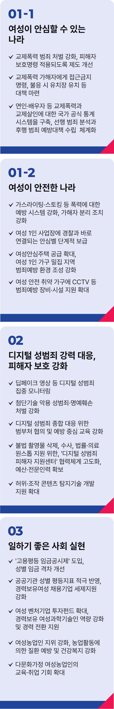

# 여성 정책

## 여성+모두 안전한 나라!
### 여성 안전을 넘어 모두가 안전하고 행복한 나라를 만들겠습니다



```
모두가 존중받고 행복한 나라를 만드는
모두의 대통령이 되겠습니다
```

과거로 돌아가서는 안 됩니다. 윤석열 정부 출범 이후 지난 3년, 대한민국 민주주의는 뒷걸음질 쳤습니다.

국민 모두가 동등하게 존중받는 세상으로 다시 나아가야 합니다. 차별은 줄이고 불공정은 바로 잡아 모두의 권리를 증진하겠습니다.

### 첫째, 여성이 안전한 나라를 만들겠습니다.

교제폭력 범죄에 대한 처벌을 강화하고, 아울러 반드시 피해자 보호명령이 적용되도록 제도를 개선하겠습니다. 교제폭력 가해자에게
접근금지명령, 불응 시 접근금지 명령의 실효성 확보를 위한 유치장 유치 등 강력한 대책을 마련하겠습니다.

연인이나 배우자 등 친밀한 관계에서 발생한 교제폭력은 여전히 법적 보호의 사각지대에 놓여 있습니다. 강력범죄나 보복으로 이어지지
않도록 관련 제도를 보완하겠습니다. 교제폭력과 교제살인에 대한 국가 공식 통계 시스템을 구축해, 선행 범죄 분석과 후행 범죄 예방대책
수립을 체계화하겠습니다.

가스라이팅과 스토킹 등 새로운 형태의 여성폭력에 대한 제도적 예방 시스템을 강화하고, 가해자 분리 조치도 강화하겠습니다.

여성 혼자 근무하는 사업장에는 경찰과 바로 연결되는 안심벨을 단계적으로 보급하겠습니다.

여성안심주택 공급을 확대해 저소득 여성 1인 가구도 안심하고 거주할 수 있게 하겠습니다. 여성 1인 가구 밀집 지역의 범죄 예방 환경
조성을 강화하겠습니다. 여성 안전 취약 가구에 CCTV 등 범죄예방 장비와 시설 지원도 확대하겠습니다.

### 둘째, 디지털 성범죄에 강력히 대응하고, 피해자 보호를 강화하겠습니다.

딥페이크 영상 등 디지털 성범죄를 집중 모니터링하고, AI 등 첨단 기술을 악용한 성범죄와 명예훼손에 대한 처벌을 강화하겠습니다.

디지털 성범죄 종합 대응을 위해 범부처가 협의해 대응할 수 있도록 하고, 예방 중심의 체계적 교육도 강화하겠습니다.

불법 촬영물의 삭제와 수사, 법률‧의료지원이 원스톱으로 가능하도록 ‘디지털 성범죄 피해자 지원센터’ 협력체계를 고도화하고 충분한
예산과 전문 인력을 확보하겠습니다. 딥페이크 영상 등 허위‧조작 콘텐츠의 탐지기술 개발지원도 확대하겠습니다.

### 셋째, 일하기 좋은 사회를 만들겠습니다.

‘고용평등 임금 공시제’를 도입하고, 성별 임금 격차를 개선해 가겠습니다.

공공기관에는 성별 평등 지표를 적극 반영하고, 경력보유여성 채용 기업에는 세제지원을 강화하겠습니다.

여성 벤처기업 투자펀드를 확대해 창업과 성장을 뒷받침하고, 경력보유 여성과학기술인의 역량 강화와 경력 전환을 적극 지원하겠습니다.

여성농업인 지위를 강화하고, 특수건강검진사업을 확대해 농업활동에 의한 질환 예방과 건강복지를 강화하겠습니다. 다문화가정
여성농업인의 교육과 취업도 더 넓게 지원하겠습니다.

대한민국에서 여성으로 살아간다는 것은 일과 가정의 조화, 건강한 삶을 위한 지원, 한부모 가족 등 지원, 학교 및 평생교육 등의 다양한
의제를 포함하고 있습니다. 동시에 남성에게도 또 다른 무게를 지닌 '모두의 과제'이기도 합니다. 이들을 여성 정책의 범주로 국한해
말씀드리지 않겠지만 앞으로도 공약집 발표를 통해 여성이 안전하고 일하기 좋은 사회를 만들기 위한 정책은 계속 발표해 나갈 것입니다.

오늘 말씀드린 안전정책, 노동정책 등도 굳이 여성정책으로 분류하지 않아도 될 날을 꿈꿉니다. 여성이 안전한 나라를 넘어 모두가
안전하고 행복한 대한민국을 만들겠습니다. 편견과 차별, 혐오를 넘어 정의와 인간존엄, 연대의 정신이 활발하게 살아있는 나라를
만들겠습니다.

이제부터 진짜 대한민국,
지금은 이재명입니다.

