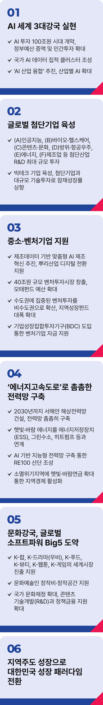

# 경제 성장

## '진짜성장' 시대
### 경제 대도약으로 '진짜 성장' 시대를 열겠습니다.




```
가짜 성장을 극복하고,
경제 대도약으로 진짜 성장의 시대를 열겠습니다
```

대한민국 경제가 위기입니다.

한강의 기적과 IT 강국의 신화는 이제 흘러간 전설이 되고 있습니다.

더 큰 우려는 한국 경제의 성장 엔진이 식어가고 있다는 점입니다.

대한민국 경제 위기는 ‘가짜 성장’에 집착했던 데 있습니다.

이명박 정부는 원칙 없는 토목공사 4대강 사업으로 막대한 예산을 쏟아부었지만, 경기부양 효과는 미미했고 결실은 소수가
독차지했습니다.

박근혜 정부는 ‘빚내서 집 사라’는 정책에 몰두했습니다. 기술 발전에 투자했어야 할 자원이 부동산으로 몰렸고, 청년들은 빚더미에
올라섰습니다.

윤석열 정부는 대기업과 부자를 위한 감세로 중소기업과 중산층, 서민을 성장에서 배제했습니다.

수도권 중심 정책은 지역 성장을 가로막았고, 과학기술인을 카르텔로 매도해 초격차 기술의 싹마저 짓밟았습니다.

그리고 끝내 불법 비상계엄으로 경제 회생의 희망마저도 꺾었습니다.

반짝 성장, 소수의 성장, 모방 성장은 모두 모래성에 불과합니다.

진짜 성장은 부동산 재테크가 아니라 AI, 에너지, 딥테크와 같은 미래 기술, 이미 세계를 선도하고 있는 K-문화에 대한 투자에서
시작됩니다.

진짜 경제는 수도권과 지역, 중소기업과 대기업, 청년층과 중장년층 모두의 참여로 만들어집니다.

진짜 미래는 기술을 모방하지 않고, 스스로 창조하는 힘에서 나옵니다.

진짜 대한민국은 성장의 열매를 모두가 누리고, 함께 사는 세상에서 이루어집니다.

이제 단기 부양이 아닌 지속가능한 성장, 숫자가 아닌 체감할 수 있는 성장, 초격차 첨단기술이 주도하는 성장으로 ‘진짜 대한민국, 진짜
성장의 시대’를 만들겠습니다.

‘기술주도 성장’, ‘모두의 성장’으로 만드는 경제 대도약의 시대를 열어가겠습니다.

### 첫째, AI 세계 3대 강국으로 우뚝 서겠습니다.

생성형 AI는 기술혁신을 넘어, 문명 전환의 기점이 되고 있습니다.

대한민국은 제조업 기반 수출 강국에서 세계가 부러워하는 IT 강국으로 성장했습니다. 이제 기술주도 성장으로 IT 강국을 넘어 AI
강국으로 도약해야 합니다.

AI 투자 100조 원 시대를 열겠습니다.

정부예산을 대폭 증액해 민간투자의 마중물이 되겠습니다.

국가 AI 데이터 집적 클러스터를 조성해 대한민국을 글로벌 AI 허브로 만들겠습니다.

‘AI 산업 융합’의 물꼬를 열겠습니다.

테슬라는 AI 자율주행으로 미래차 시장을 선점했고, 구글은 단백질 구조 예측 AI로 생명과학의 난제를 해결했습니다.

AI는 다양한 산업과 융합되며 무한한 확장성을 보여주고 있습니다.

범용 AI뿐 아니라 산업별 AI를 확대하고 융합해 산업, 문화, 국방, 에너지 등 전 분야에서 기술주도 AI 산업혁명을 이루겠습니다.

### 둘째, 세계를 선도하는 글로벌 첨단기업을 육성하겠습니다.

글로벌 첨단기업들은 과학을 씨앗 삼고
, 기술로 꽃을 피워 세계를 제패했습니다.

대한민국에서도 벤처기업이 글로벌 기업으로 성장할 수 있는 과학기술 혁신 생태계를 만들겠습니다.

경제성장을 견인할 (A)인공지능, (B)바이오․헬스케어 산업, (C)콘텐츠․문화산업, (D)방위․항공우주, (E)에너지산업, (F)제조업 등 첨단 산업
R&D에 사상 최대 규모로 투자하겠습니다.

민간이 중심이 되는 R&D를 확대해 급변하는 경제와 시장에 대응하겠습니다.

정부가 빅테크 기업 육성에 적극 나서겠습니다.

세계 1위 반도체 파운드리 기업 TSMC는 정부 투자가 성장의 마중물이 된 대표적 성공 사례입니다.

미국도 전략산업 육성과 첨단기술 확보를 목적으로 국부펀드 설립을 추진하고 있습니다.

우리도 더 이상 늦출 수 없습니다.

국민과 기업이 함께 참여하는 100조 원 규모의 펀드를 만들어가겠습니다.

첨단기업과 대규모 기술투자로 국가 잠재성장률을 끌어올리겠습니다.

### 셋째, 중소·벤처기업을 경제의 핵심 성장기반으로 만들겠습니다.

첨단 산업이 성공하려면, 중소·벤처기업의 혁신과 지원이 필요합니다.

중소기업을 지능형·자율형 공장으로 확대 전환하고, 제조데이터 기반 맞춤형 AI 제조혁신을 추진하겠습니다.

뿌리산업의 디지털 전환을 지원하고, 첨단전략산업과 연계한 미래기술을 확보하겠습니다. 우수 인재가 몰리는 제조중소기업을
키우겠습니다.

40조 원 규모의 벤처투자시장을 창출하겠습니다.

모태펀드 예산을 확대하고, 안정적인 운영을 위해 존속기간을 연장하겠습니다.

퇴직연금의 벤처투자를 허용하고, 연기금 투자풀(*)의 벤처투자도 확대하겠습니다.

(*) 연기금 투자풀 : 기금 여유자산의 수익률을 제고하고 안정적으로 관리하기 위해 기금 여유자금을 통합하여 운용하는 투자체계
기업성장집합투자기구(BDC)를 도입해 성장잠재력이 큰 벤처기업에 안정적인 자금을 지원하겠습니다.

벤처·스타트업을 지역 성장의 엔진으로 집중 육성하겠습니다.

수도권에 집중된 벤처투자를 비수도권으로 확산시키고
, 정부·지자체·금융기관·지역사회가 함께 참여하는 지역성장펀드를 대폭
확대하겠습니다.

유망 기술인력의 창업을 지원하는 팁스(Tips) 프로그램을 비수도권 중심으로 확대하고, 엔젤투자허브와 스타트업파크를 구축해 지역에서
시작되는 벤처주도 성장 기반을 만들겠습니다.

### 넷째, '에너지고속도로’로 촘촘한 전력망을 구축해 위기를 기회로 만들겠습니다.

재생에너지는 기후 위기 대응 핵심 수단이며, 산업과 국가경쟁력을 이끄는 동력입니다.

2030년까지 서해안 해상전력망을 건설하겠습니다.

재생에너지가 전국 곳곳에서 생산되고 소비될 수 있도록, 전력망을 촘촘히 구축하겠습니다.

햇빛과 바람 에너지를 에너지저장장치(ESS), 그린수소, 히트펌프 등과 연계하고, AI기반 지능형 전력망을 구축해 RE100 산단을
조성하겠습니다.

에너지, 배터리, 전기차 등 탄소중립 산업을 독보적인 수준으로 끌어올리겠습니다.

박정희의 경부고속도로, 김대중의 정보화고속도로처럼 이제는 에너지고속도로로 대한민국의 대도약을 이끌겠습니다.

소멸위기지역에 햇빛·바람연금을 확대해 지역경제를 살리겠습니다.

여주 구양리는 공동체 태양광으로 월 1,000만 원의 수익을 올리고, 이를 활용해 무료 마을버스, 경로당 무료 급식 등을 진행하고 있습니다.

‘햇빛‧바람 연금’을 전국으로 확산해 주민 소득을 늘리고, 지역이 더 살기 좋은 대한민국을 만들겠습니다.

### 다섯째, 문화강국, 글로벌 소프트파워 Big 5를 만들겠습니다.

K-컬처는 이제 글로벌 주류문화로 도약하고 있습니다.

대한민국은 더 이상 세계 트렌드를 따라가는 나라가 아니라, 트렌드를 만드는 문화강국이 되어가고 있습니다.

문화산업을 대한민국의 미래성장 기반으로 키우겠습니다.

K-팝, K-드라마(무비), K-푸드, K-뷰티, K-웹툰, K-게임의 세계시장 진출을 전폭 지원해 K-컬처 시장 규모 300조 원 시대를 열겠습니다.

문화예술인에게 창작비와 창작공간 등을 제공해 창작활동에만 집중할 수 있는 환경을 만들겠습니다.

국가 문화재정을 대폭 확대해 콘텐츠 기술개발(R&D)과 정책금융 지원을 확대하겠습니다.

문화의 힘은 사람에서 나옵니다.

인문학적 소양은 창작의 원천이고,
그 자체로 문화예술의 중요한 자원입니다. 인문학 교육을 활성화해 문화강국의 토대를 견고히
하겠습니다.

### 여섯째, 지역주도 성장으로 대한민국 성장의 패러다임을 바꾸겠습니다.

수도권에 편중된 경제 인프라가 대한민국의 발목을 잡고 있습니다. 균형발전 없이 지속 가능한 성장은 불가능합니다. 이제 지역을
대한민국 경제 대도약의 주역으로 만들겠습니다.

부울경과 호남, 남부 제조업 벨트에 산업 르네상스를 실현하겠습니다.

부울경의 핵심 산업인 조선, 철강, 기계부품, 자동차, 로봇 등을 집중 지원해, 부울경을 미래산업의 선도주자로 만들겠습니다. 북극항로
시대를 대비해 항공, 철도, 해운이 결합된 ‘트라이포트’ 전진기지를 구축하고, 해양 관련 공공기관들을 이전해 해양수도로 키우겠습니다.

호남권은 AI 선도 지역으로 육성하고, 재생에너지, 화이트바이오 등 친환경․미래산업의 중심지로 만들겠습니다. 미래형 농생명․식품
산업의 중심지를 조성해 K-푸드 혁명을 주도하겠습니다.

대경권은 휴머노이드 등 AI로봇산업을 진두지휘하는 지역으로 성장시키겠습니다.

이차전지, 자동차부품, 섬유 등 지역의 주력 산업에 대한 지원을 확대하고,
그린철강 산업을 육성해 글로벌 철강의 미래를 이끌겠습니다.

대경권의 자랑인 농업, 의료, 식품 산업을 연계해 바이오산업의 핵심지역으로 만들겠습니다.

중부권은 과학중심․기술주도 성장의 핵심지역으로 키우겠습니다. 충청권 연구단지들을 글로벌 과학기술 혁신 클러스터로 재창조하고,
세계적 과학기술 인재 양성 요람으로 만들겠습니다. 이차전지, 우주산업, 바이오, 반도체, 디스플레이를 잇는 세계적인 첨단산업 벨트를
구축하겠습니다.

강원권과 제주권은 관광수도로 육성하겠습니다. 전세계가 주목하는 15조 원 규모의 국내 관광시장에 대응해 강원과 제주를 ‘대한민국 방문
필수코스’로 만들겠습니다.

관광인프라를 개선하고, ‘관광 한국’에 걸맞은 관광 콘텐츠 개발을 지원하겠습니다.

윤석열 정부 3년간 ‘가짜 성장’으로 대한민국의 경쟁력이 퇴보했습니다. 곤두박질친 경제지표들을 이제 기술 주도 성장으로 되돌려야
합니다.

모든 국민, 모든 지역, 대기업부터 소상공인까지 모든 경제주체가 성장의 과실을 함께 누려야 그게 바로‘진짜 성장’입니다.

그 과실은 다시 대도약의 씨앗이 되어 대한민국이라는 거대한 나무로 자라야 합니다.

저 이재명이 멈춰 선 경제성장을 회복하고, 대한민국을 세계 5대 경제 강국으로 만들겠습니다. 진짜 경제성장의 시대를 열겠습니다.

이제부터 진짜 대한민국입니다.

지금은 이재명입니다.