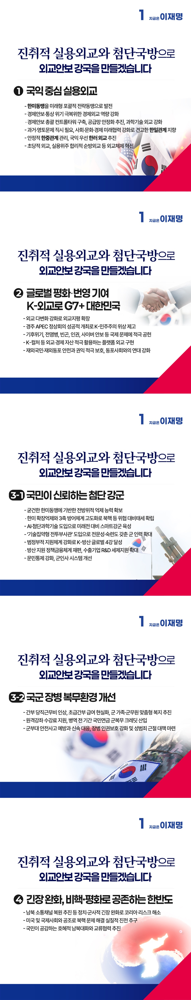

# 외교안보 정책



```
대전환의 시대, 진취적 실용외교와 첨단국방으로
외교안보 강국을 만들겠습니다
```

미‧중 전략경쟁 속에서 글로벌 안보환경의 불안정성은 날로 커지고 있습니다.

다자주의와 자유무역 기반 경제·통상 질서도 대혼란입니다.

분단국가 대한민국은 안보가 경제이고, 평화가 민생입니다.

경제, 외교, 국방을 각각 따로 떼어 생각할 수 없습니다.

대전환의 국제질서 가운데 국익을 지키는 외교안보 강국을 만들겠습니다.

### 첫째, 미래를 여는 국익중심 실용외교를 펼치겠습니다.

이재명의 실용외교는 굳건한 한미동맹을 토대로 합니다.

불법계엄으로 훼손된 한미동맹의 신뢰기반을 복원하고, 미래형 포괄적 전략동맹으로 발전시키겠습니다.

한미일 협력도 견고히 하겠습니다.

일본은 중요한 협력 파트너입니다.

한일 수교 60주년을 맞아 과거사 ·영토 문제는 원칙적으로,
사회 ·문화 ·경제 영역은 전향적·미래지향적으로 대응하겠습니다.

일관되고 견고한 한일관계의 토대를 다지겠습니다.

중국은 중요 무역상대국이자 한반도 안보에도 영향을 미치는 나라입니다.

지난 정부 최악의 상태에 이른 한중 관계를 안정적으로 관리해 나가겠습니다.

미러 관계와 우크라이나 전쟁은 새로운 전기를 맞고 있습니다.

한러 관계를 국익 우선의 관점에서 다루고, 우크라이나 재건에 기여하며 한반도 안보와 우리 기업을 위한 실용 외교를 펼치겠습니다.

보호주의가 확대되고, 공급망 재편과 불안정이 심화되고 있습니다.

경제·통상과 안보이슈의 연계도 우리 앞의 과제입니다.

난관을 기회로 바꾸겠습니다.

조선, 방산, 첨단산업 등 미국과 협력할 분야는 넓습니다.

상호 이익을 균형있게 조정하며 관세를 협상하겠습니다.

경제안보 현안을 총괄하는 컨트롤타워를 구축하고,
주요국들과 연대·협력을 강화해서 공급망을 안정화하도록 하겠습니다.

국익과 기업 이익을 아우르는 민·관 공동 대응체계도 마련하겠습니다.

AI, 반도체, 양자컴퓨터, 우주 등 첨단산업 분야 과학기술 외교도 강화해 나가겠습니다.

외교체제 혁신하겠습니다.

여야대표 외교 협의체를 정례화 하는 등 초당적 외교를 추진하겠습니다.

수행단 규모 합리화 등 실용위주 순방외교를 구현하겠습니다.

### 둘째, 한국의 정체성과 가치를 구현하는 공공외교, 글로벌 평화·번영에 기여하는 K-외교로 G7+ 대한민국을
이루겠습니다.

급변하는 국제질서 속에서 중요성과 역할이 날로 증가하는
글로벌사우스 국가, 아세안, 브릭스, 서남아시아, 아프리카, 중앙아시아 국가 등과
외교를 다변화해 대한민국의 외교 지평을 넓히겠습니다.

경주 APEC 정상회의를 성공적으로 개최하겠습니다.

12.3 계엄을 극복하고 민주 헌정질서를 회복한 K-민주주의를 널리 알려 국제적 위상과 추락한 외교력의 복원 계기로 삼겠습니다.

기후위기, 식량난, 전염병, 빈곤, 인권, 사이버 안보 등,
인류가 직면한 국제 문제에 국가 위상에 걸맞은 적극적 공헌을 해나가겠습니다.

K-컬처 등 소프트파워는 소중한 외교·경제자산입니다.

재외공관을 한국문화 전파 플랫폼이자 국가 이미지 제고의 첨단기지로 활용하겠습니다.

영사 서비스를 혁신해 재외국민의 안전과 권익을 적극 보호하겠습니다.

재외동포의 정체성 함양과 민간외교 활동을 적극 지원하고,
공공문화 거점을 조성하여 동포사회와의 연대를 강화하겠습니다.

재외국민의 실질적 참정권 행사를 적극 지원하겠습니다.

우편투표제 도입과 투표소 설치 확대, 투표시간 연장을 추진하겠습니다.

### 셋째, 국민이 신뢰하는 첨단 강군을 육성하겠습니다.

12.3 불법계엄으로 훼손된 대한민국 국군의 위상을 복원하고 국민 신뢰를 되찾을 수 있도록 하겠습니다.

군이 위헌·위법한 정치적 폭거에 동원되는 일은 다시는 없어야 합니다.

문민 통제를 강화하고, 군인사 시스템을 개선하겠습니다.

방위력 증강은 안보의 핵심입니다.

공고한 한미연합방위체제를 기반으로 한미 확장억제 체계와 3축 방어체계를 고도화하고,
북한의 비대칭 위협에 대한 대비태세를 확고히 하겠습니다.

AI 등 첨단과학기술을 적극 도입하여 우리 군을 21세기 미래전에서 반드시 승리하는 무적의 스마트 강군으로 육성하겠습니다.

군의 운용, 작전, 장비를 첨단화·스마트화·무인화하여 병력자원 감소에도 능동적으로 대처하겠습니다.

국민개병제는 유지하면서 병역대상자가 ‘징집병’과 ‘기술집약형 전투부사관’중 선택할 수 있도록 하겠습니다.

군인력의 전문성과 숙련도를 높이고 확대하는 길입니다.

우리 방위산업이 국제사회의 주목을 받고 있습니다.

방산지원 정책금융체계를 재편하고, 수출기업의 R&D 세제 지원을 확대하여 기업의 경쟁력을 더욱 높이겠습니다.

국군 장병의 사기를 높이고 복무환경을 개선하겠습니다.

간부들의 당직근무비를 일반공무원 수준으로 인상하겠습니다.

특히 초급간부에 대해서는 급여를 현실화하고 전·월세 정책자금 연계 등 지원을 확대해 나가겠습니다.

군 가족과 군무원에 대한 맞춤형 복지도 추진하겠습니다.

원격강좌 수강료 100% 지원 등
장병의 자기개발 여건도 개선하겠습니다.

병역 전 기간 국민연금 군복무크레딧 산입도 다시 약속드립니다.

모두가 건강하고 안전한 군복무 환경을 만들겠습니다.

군부대 안전사고 예방과 신속 대응,
투명한 사후 규명 시스템을 견고하게 구축하겠습니다.

장병의 인권 보호를 강화하고, 성범죄 근절 대책을 마련하겠습니다.

### 넷째, 긴장완화와 비핵평화로 공존하는 한반도를 추구하겠습니다.

북한 비핵화 프로세스가 중단된 지 오래입니다.

북한의 핵·미사일 능력은 나날이 강화되고 있습니다.

더 이상 방치할 수 없습니다.

한반도 평화와 북핵 문제 해결의 실질적 진전을 위해
동맹 미국과 긴밀하게 공조하고,
국제사회와도 중층적인 협력의 틀을 추구해 나가겠습니다.

경제 활성화와 민생 안정을 위해서는 코리아 리스크를 해소해야 합니다.

군사 핫라인 등 남북 소통채널 복원을 추진하여,
긴장 유발 행위를 상호 중단하고, 상황을 안정적으로 관리하겠습니다.

국민이 공감하는 호혜적 남북대화와 교류협력을 추진하겠습니다.

이산가족, 납북자, 국군포로, 북한이탈주민 등
분단의 고통을 겪는 우리 국민을 위한
인도적 지원과 제도 개선에도 힘을 쏟겠습니다.

북한주민의 인권이 실질적으로 개선될 수 있도록 노력하겠습니다.

대북정책이 정치적 도구가 되어서는 안됩니다.

한반도 평화와 통일만 생각해야 합니다.

사회적 대화로 국민과 함께 만들어 가겠습니다.

그 무엇으로부터도 안전한 국민,
그 어떠한 것도 위협할 수 없는 대한민국!