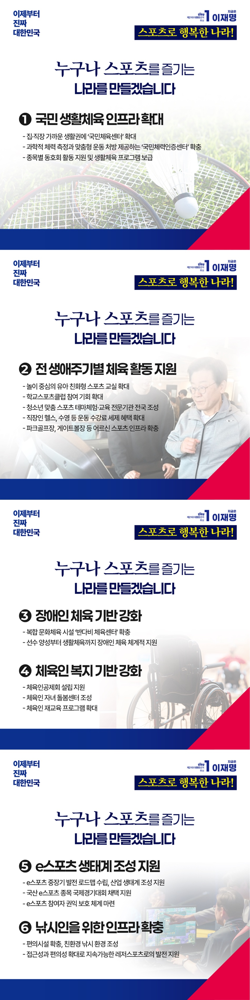

# 스포츠 정책



```
누구나 스포츠를 즐기는 나라를 만들겠습니다
```

2024년 파리 올림픽에서 대한민국 선수단은 역대 최고의 성과를 거뒀습니다. 선수들의 헌신과 땀방울은 국민께 큰 감동을 안겼습니다. 스포츠가
우리에게 주는 희망과 기쁨을 다시금 확인한 순간이었습니다.

이제 그 감동이 경기장을 넘어 우리의 일상 속으로 스며들게 하겠습니다. 누구나 쉽게 스포츠를 즐기고, 건강하게 살아갈 권리를 누릴 수 있도록 국가가
든든히
뒷받침하겠습니다.

### 첫째, 스포츠가 일상의 여가활동이 되도록 하겠습니다.

누구나 집과 직장 가까이에서 언제든 운동할 수 있도록 국민체육센터를 확충하겠습니다.

과학적인 체력 측정과 맞춤형 운동 처방을 제공하는 ‘국민체력인증센터’를 각지에 두어서 내 몸에 맞는 체력 관리를 돕겠습니다.

종목별 동호회 활동을 체계적으로 지원하고, 주민들이 쉽게 참여할 수 있는 생활체육 프로그램도 다양하게 넓히겠습니다.

### 둘째, 유아부터 어르신까지 맞춤형 체육활동을 지원하겠습니다.

놀이 중심의 유아 친화형 스포츠 교실을 확대해, 아이들이 어릴 때부터 자연스럽게 운동에 익숙해질 수 있는 환경을 조성하겠습니다.

학교스포츠클럽의 참여기회를 넓혀 ‘1인 1스포츠’를 실현할 수 있는 토대를 만들겠습니다.

청소년들이 다양한 스포츠를 체험할 수 있도록, 스포츠 테마 체험·교육 전문기관인 ‘스포츠 가치 센터’를 전국 곳곳에 조성하겠습니다.

직장인에게는 헬스, 수영 등 운동 수강료에 대한 세제 혜택을 확대하겠습니다.

어르신들이 언제 어디서나 편리하게 운동하실 수 있도록, 파크골프장과 게이트볼장 등 어르신 스포츠 인프라도 확대하겠습니다.

### 셋째, 장애인 체육의 기회를 넓히고 기반을 강화하겠습니다.

파리 패럴림픽에서 철인 3종 경기를 완주한 대한민국 선수는 전 세계에 깊은 감동을 안겼습니다. 장애를 넘는 이 도전을 장애인 체육에 대한 사회적
관심과 투자로 이어가겠습니다.

장애인에게 차별 없는 체육활동의 기회를 제공하는 ‘반다비 체육센터’를 지속적으로 확충하겠습니다.

선수 양성부터 생활체육까지 장애인 체육을 체계적으로 지원하겠습니다.

### 넷째, 체육인의 복지 기반을 강화하겠습니다.

체육인공제회 설립을 지원해, 갑작스러운 사고나 생계의 어려움에 대비할 수 있는 든든한 버팀목을 마련하겠습니다.

훈련과 생계를 병행하느라 힘든 체육인들이 안심하고 아이를 맡길 수 있도록, 체육인 자녀 돌봄센터를 조성하겠습니다.

체육인 재교육 프로그램도 확대해 새로운 삶을 준비하는 체육인들의 미래를 함께 설계하겠습니다.

### 다섯째, e스포츠의 미래를 열겠습니다.

e스포츠가 아시안게임 정식 종목으로 채택되었지만, 여전히 스포츠로서의 인식은 부족합니다.

e스포츠 중장기 발전 로드맵을 수립해 인식을 개선하고, 산업 생태계 조성에도 지원을 아끼지 않겠습니다.

지난 아시안게임에서 국산 e스포츠는 단 하나에 그쳤습니다. 국산 e스포츠 종목이 국제대회에서 채택될 수 있도록 적극 뒷받침하겠습니다.

미성년 선수와 직원을 포함한 모든 참여자가 건강하고 안전한 환경에서 활동할 수 있도록, 권익 보호 체계를 선도적으로 마련하겠습니다.

### 여섯째, 낚시인들을 위한 인프라를 확충하겠습니다.

주요 낚시터와 수변공원에 편의시설을 늘리고, 환경을 해치지 않으면서도 즐길 수 있는 친환경 낚시 환경을 조성하겠습니다.

접근성과 편의성을 높여,
교통약자도 함께 즐길 수 있는 지속가능한 레저 스포츠로 발전할 수 있도록 지원하겠습니다.

스포츠는 건강한 삶의 시작이자, 모두를 하나로 잇는 힘입니다.

국민 모두가 일상에서 스포츠를 즐기고, 건강한 삶을 누리는 나라를 만들겠습니다.