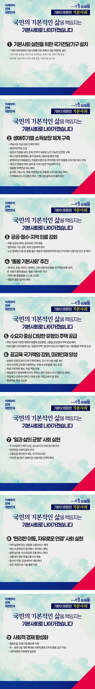

# 기본사회 정책

## 기본이 튼튼한, 기본사회



```
국민의 기본적인 삶은 국가 공동체가 책임지는 사회,
기본사회로 나아가겠습니다
```

저성장시대에 접어들며 기회와 자원의 불평등이 심화되고 있습니다. 격차와 양극화가 성장을 가로막고, 협력과 공존은 사라지고 극한 경쟁만
남았습니다.

현행 복지제도는 ‘누구나 일할 수 있다’는 가정을 전제로 탈락자를 대상으로 합니다. 인공지능과 로봇이 생산을 주도할 첨단기술 사회에서는 한계가
분명합니다.

초과학기술 발전이 초래할 수 있는 사회구조적 위기를 극복하기 위해서는 기존 제도와는 완전히 다른 접근을 해야 합니다. 구멍이 있는 사회 안전망을
넘어 빈틈이 없는 두툼한 안전매트가 깔린 ‘기본사회’로 나가야 합니다.

기본사회는 단편적인 복지정책이나 소득 분배에 머무르지 않습니다. 우리 헌법에 명시된 행복추구권과 인권을 바탕으로, 모든 국민의 기본적 삶을
실질적으로 보장하는 사회입니다.

주거, 의료, 돌봄, 교육, 공공서비스 같은 삶의 모든 영역에서 우리 헌법에 명시된 국민의 모든 권리를 최대한 실현하고, 국가와 사회가 함께 책임지는
‘기본사회’를 열어가겠습니다.

### 첫째, 기본사회 실현을 위한 국가전담기구를 설치하고 민관협력체계를 구축하겠습니다.

기본적인 삶이 권리로 보장되고, 안전매트가 깔린 사회라야 지속 가능한 혁신과 성장이 가능합니다.

‘기본사회위원회(기본사회를 위한 회복과 성장 위원회)’를 설치하고 기본사회 실현을 위한 비전과 정책 목표, 핵심 과제 수립 및 관련 정책 이행을
총괄·조정·평가하겠습니다.

생애소득 보장과 의료·돌봄·주거·교육 등 분야별 기본 서비스 추진 상황을 점검하고, 시범사업을 실시해 우수 정책을 체계적으로 확산·지원하겠습니다.

기본사회는 정부의 노력만으로 실현될 수 없습니다. 민간 기업과 시민사회 조직, 사회적경제 조직, 협동조합 등 다양한 주체들과 함께 협력하는 체계를
구축하겠습니다. 민관협력을 활용해 재정 부담은 줄이고, 정책의 효과는 높이겠습니다.

사회적경제 관련 법․제도를 정비하고, 협동조합과 마을기업이 더욱 활발히 활동할 수 있도록 지원하겠습니다.

국·공유시설 개방을 확대해 공익 목적을 가진 사회적경제 조직이 안정적으로 활동할 수 있는 공간을 확대하겠습니다.

정부 부처별로 분산된 사회적경제 지원체계를 일원화해 주민이 스스로 돌보고 가꾸는 기본사회가 실현될 수 있도록 지원하겠습니다.

### 둘째, 태어날 때부터 노후까지 생애주기별 소득 보장 체계를 촘촘히 구축하겠습니다.

누구나 예측이 가능한, 안정된 삶을 누릴 수 있는 사회를 만들어야 합니다.

아동수당 지급 대상을 단계적으로 확대하겠습니다. ‘청년미래적금’을 도입해 청년의 자산 형성과 사회 진입을 지원하겠습니다.

단순한 일자리 지원을 넘어, 은퇴 전까지 언제든 새로운 도전이 가능한 안전망을 구축하겠습니다.

특수고용직과 플랫폼 노동자 등에게 고용보험을 확대 적용하겠습니다.

영케어러(가족 돌봄인), 자립준비청년 등 소득 보장 사각지대에 놓인 취약계층을 위한 맞춤형 소득지원 제도를 강화하겠습니다.

모두의 존엄한 노후를 위해, 세대 간 형평성과 연대를 실현하며 지속 가능한 연금 개혁을 추진하겠습니다.

다양한 삶의 조건을 반영한 맞춤형 주택연금 제도를 확대해 주거와 소득이 함께 안정되는 노후 안전망을 강화하겠습니다.

농어촌 기본소득과 햇빛․바람 연금 등 지역 특성과 자원을 살린 맞춤형 소득지원 제도를 확대하겠습니다.

지역화폐와 온누리 상품권을 확대해 유통과 사용 편의성을 높이고, 전통시장과 골목상권의 활력을 되찾겠습니다.

### ### 셋째, 누구나 차별 없이 치료받을 수 있도록 공공·필수·지역 의료를 강화하겠습니다.

우리나라는 민간 중심의 의료 공급으로 지역 간 격차와 필수의료 공백이 심각합니다. 소득 수준에 따른 의료 접근성 차이도 큽니다.

의료의 공공성을 높이고, 공공 의료 인력을 확충해 모두가 동등하게 치료받을 수 있는 기반을 만들겠습니다.

일차의료 기능을 강화하고, 의료 전달 체계를 정비해 사는 곳 중심으로 최적의 의료서비스를 받을 수 있는 환경을 조성하겠습니다.

노인, 장애인, 아동 등 특별한 돌봄이 필요한 분들과 의료 취약 지역을 대상으로 주치의제 시범사업을 추진한 후, 이를 모든 국민에게 확대하겠습니다.

### 넷째, 온 사회가 함께 돌보는 ‘돌봄 기본사회’를 추진하겠습니다.

‘돌봄 기본사회’는 돌봄을 가족과 개인의 몫이 아닌, 사회 전체가 함께 책임지는 사회입니다. 이는 초저출생·초고령 사회에 대응하는 대한민국의 생존
전략이자 성장 전략입니다.

영유아, 초등, 어르신, 장애인, 간호·간병 등‘5대 돌봄 국가 책임제’를 넘어, ‘온 사회가 함께 돌보는 돌봄 기본사회’를 만들겠습니다.

지역사회 통합돌봄 시스템을 고도화해, 누구나 살던 곳에서 계속 거주하며 돌봄과 의료 서비스를 받을 수 있게 하겠습니다.

양질의 돌봄 일자리를 확대해, 돌봄이 단순한 서비스를 넘어 신성장 산업으로 자리 잡게 하겠습니다.

### 다섯째, 수요자 중심의 폭넓고 다양한 유형의 주택을 공급하겠습니다.

우리나라 주택 가격은 소득 수준에 비해 지나치게 높습니다. 청년들이 미래를 꿈꾸려면, 적정한 주거비로 안정된 삶을 시작할 수 있어야 합니다.

부담 가능한 다양한 형태의 맞춤형 공공분양과 고품질 공공임대 주택 공급을 확대하겠습니다.

어르신이 함께 사는 공동체 주택, 청년과 어르신이 어울려 사는 세대 통합 주택 등 다양한 삶의 조건에 맞춘 주거 환경을 조성하겠습니다.

### 여섯째, 공교육에 국가 책임을 강화하고, 미래 인재를 양성하는 교육 체계로 전환하겠습니다.

보육비 지원과 유아교육을 단계적으로 확대하고, 교사 대 아동 비율을 개선하겠습니다.

국가와 지자체, 교육청이 함께 지원하는‘온동네 초등돌봄’제도를 도입해 국가와 사회가 함께 책임지는 돌봄 시스템을 구축하겠습니다.

학생들의 기초학력을 높이고, 학습 역량을 강화하겠습니다.

학습 결과가 잠재력에 미치지 못해 지원이 필요한 학생에게는 전문교사의 개별지도를 확대하겠습니다.

직업계 고등학교, 전문대, 대학 간 연계를 강화해 직업교육의 질을 높이겠습니다.

평생교육 지원을 확대하겠습니다. 누구나 언제든지 배울 수 있는 평생학습 체제를 고도화하겠습니다.

### 일곱째, 일과 삶이 균형 잡힌 사회를 만들겠습니다.

AI와 첨단기술로 높아진 생산성은 노동시간 단축으로 이어져야 합니다.

주 4.5일제 단계적 도입과 실노동시간 단축 로드맵을 추진해, 일하는 권리도 쉴 권리도 당연히 존중받는 사회를 만들겠습니다.

정년연장을 사회적 합의로 추진하겠습니다.

고용보험과 육아휴직 제도의 사각지대를 지속적으로 보완해 고용 형태나 소득 수준에 상관없이 누구나 일할 권리와 돌볼 권리를 보장받도록
하겠습니다.

‘아프면 쉴 권리’인 상병수당 시범사업을 단계적으로 확대해 모두에게 더 두터운 사회적 안전망을 제공하겠습니다.

### 여덟째, 누구나 편리하게 이동하고, 자유롭게 연결되는 사회를 만들겠습니다.

수도권과 광역시를 제외하면 대중교통 혜택을 누리기 어렵습니다. 이동 수단과 반경의 차이는 곧 기회의 차이로 이어지고 있습니다.

지역 실정에 따른 맞춤형 교통 서비스를 확대하겠습니다.

대도시와 광역권에서는 청년·국민패스 등을 확대해 교통비 부담을 줄이고, 읍면과 농어촌 지역에는 수요응답형 교통 서비스를 확대하겠습니다.

우리 국민 10명 중 3명인 교통약자를 위한 특별교통수단도 확충하겠습니다.

통신비 지원과 공공데이터 개방을 확대해 정보 접근성을 높이겠습니다.

모든 국민이 AI 기술을 활용해 새로운 기회를 누리도록 지원하고, 대한민국 전체가 함께 성장하는 기반을 마련하겠습니다.

국가가 국민의 미래를 책임지고, 희망과 혁신의 꽃을 피워내는 기본사회를 열겠습니다.

모두가 함께 잘 사는 세상, 다시 희망이 펄럭이는 나라, 국민의 삶을 지키는 기본이 튼튼한 대한민국을 만들겠습니다.

이제부터 진짜 대한민국
지금은 이재명입니다.