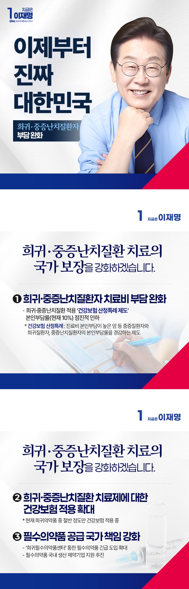

# 희귀·중증난치질환자 부담 완화 공약



```
희귀질환과 중증난치질환 치료의 국가 보장을 강화하겠습니다
```

누구나 아플 수 있지만, 그렇다고 모두 다 치료받을 수 있는 건 아닙니다. 희귀질환이나 중증난치질환은 진단부터 치료까지 모든 과정이 고통입니다.

환자와 가족은 병으로 인한 고통은 물론 생계문제와 고립, 불안과도 싸워야 합니다.

지난해 우리나라의 희귀질환자는 37만 명, 중증난치질환자는 75만 명이었습니다. 최근 5년 새 27.4%나 증가했습니다. 이들에게 병보다 더 견디기 힘든
건 치료제가 없거나 있어도 감당하기 어려울 만큼 가격이 비싸다는 점입니다.

국가는 국민의 아픔 가까이에 있어야 합니다. 희귀질환자와 중증난치질환자가 조기에 진단받고, 제때 치료받을 수 있도록 하겠습니다. 더 넓고 두터운
보장으로 의료 안전망을 강화하겠습니다.

### 첫째, 희귀·중증난치질환자의 치료비 부담을 줄이겠습니다.

현재 ‘본인부담상한제’가 일정 기준을 넘는 연간의료비를 나중에 돌려 준다지만, 당장 목돈을 내야 하는 환자와 가족에겐 큰 부담입니다.

희귀질환과 중증난치질환에 적용되는 건강보험 산정특례제도(*)의 본인부담률을 현재 10%에서 점진적으로 낮추겠습니다. 치료비 걱정을 덜겠습니다.

*건강보험 산정특례 제도 : 진료비 본인부담이 높은 암 등 중증질환자와 희귀질환자, 중증난치질환자의 본인부담률을 경감

### 둘째, 중증·희귀난치성질환 치료제에 대한 건강보험 적용을 확대하겠습니다.

현재 희귀의약품 가운데 절반 정도만 건강보험이 적용되고 있습니다.

치료 접근성을 높이고 경제적 부담을 줄이기 위해 건강보험 적용을 확대해가겠습니다.

필요한 제도 개선과 지원 방안도 지속적으로 마련하겠습니다.

###  셋째, 국가가 책임지고 필수의약품 공급을 지원하겠습니다.

최근 5년간 판매 부진, 채산성 악화 등으로 100여 개의 국가필수의약품 공급이 중단됐습니다.

필수의약품이 제때 공급되지 않으면,
그 피해는 결국 국민에게 갑니다.

희귀필수의약품센터를 통한 필수의약품 긴급 도입을 확대하고, 국내 생산 제약기업 지원도 추진하겠습니다.

국가의 제1 책무는 국민의 생명을 지키는 일입니다. 희귀하다고 포기하지 않고, 난치라고 외면하지 않는 나라를 만들겠습니다.

이제부터 진짜 대한민국입니