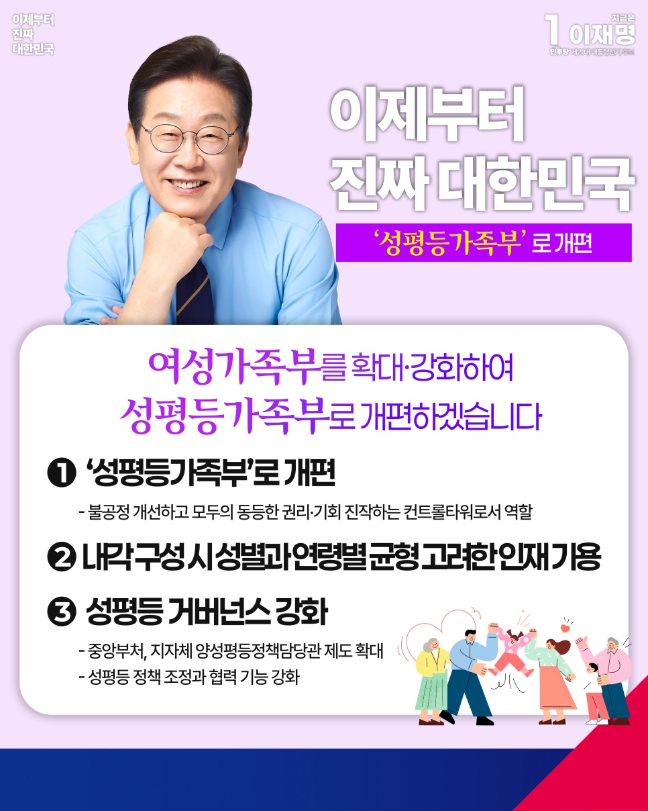

# 성평등가족부로 개편



```
여성가족부를 성평등가족부로 확대·개편하겠습니다.

모두가 동등한 권리와 기회를 누리는 사회를 만들겠습니다
```

여성들이 여전히 우리사회 많은 영역에서 구조적 차별을 겪고 있음에도, 윤석열 정권은 성평등 정책을 후순위로 미뤘습니다.

지난해 유엔 여성차별철폐위원회(CEDAW)는 한국 정부에 여성가족부 장관을 즉시 임명하고, 폐지 추진을 중단하라고 권고했습니다.

더 이상 퇴행은 안 됩니다. 모두가 동등한 권리와 기회를 누리고, 차별 없는 사회를 만들어야 합니다.

여성가족부의 기능을 확대·강화해 ‘성평등가족부’로 개편하겠습니다.

성평등은 통합과 포용, 지속가능한 사회를 실현하는 핵심가치입니다. 성평등가족부는 불공정을 바로잡고 모두의 동등한 권리와 기회를 진작하는
컨트롤타워가 되겠습니다. 부분적인 역차별이 있는지도 잘 살펴 대처하겠습니다.

향후 내각 구성 시 성별과 연령별 균형을 고려해 인재를 고르게 기용하겠습니다.

성평등 거버넌스 추진체계도 강화하겠습니다.

중앙부처와 지자체의 양성평등정책담당관제도를 확대해 성평등 정책 조정과 협력기능을 강화하겠습니다. 지자체 내 전담부서를 늘려 성평등 정책의
실효성을 높이겠습니다.

다양한 목소리를 포용하고, 공동의 해법을 모색하는 통합의 정치를 실현하겠습니다.

이제부터 진짜 대한민국.

지금은 이재명입니다.