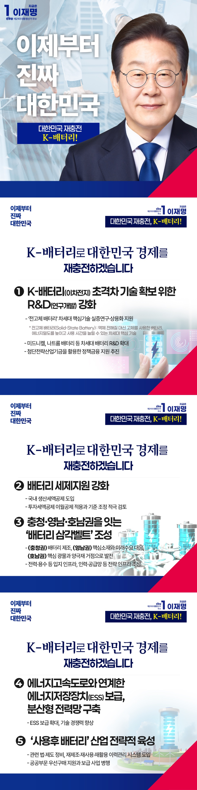

# K-배터리(이차전지)정책



```
K-배터리(이차전지)로 대한민국 경제를 재충전하겠습니다
```

배터리는 미래 산업을 움직이는 핵심 동력입니다. 전 세계 배터리 시장은 연평균 16%씩 성장해, 2034년이 되면 948조 원 규모에 이를 전망입니다.

우리나라는 세계 최고 수준의 배터리 기술력으로 글로벌 시장에서 확고한 경쟁우위를 확보하고 있습니다.

하지만 전기차 수요 둔화와 외국산 저가 배터리 공세로 수익성이 악화되며, 산업 전반이 위기를 맞고 있습니다.

배터리 산업은 대한민국 경제 대도약의 핵심입니다. 글로벌 시장을 선도할 K-이니셔티브의 중심축으로 K-배터리 산업을 육성하겠습니다.

### 첫째, 초격차 기술 확보를 위해 R&D를 강화하겠습니다.

저가 배터리 공세에 맞서려면 기술 초격차가 필수적입니다.

전고체 배터리(Solid-State Battery)는 화재위험을 줄이고 사용 시간을 늘릴 수 있는 차세대 핵심 기술로, 국가 간 경쟁이 치열한 분야입니다.

전고체 배터리의 실증 연구부터 상용화까지, 국가가 적극 뒷받침하겠습니다.

미드니켈과 나트륨 배터리 등, 차세대 배터리 기술 R&D도 함께 확대하겠습니다.

국가 산업 경쟁력과 에너지 안보 강화를 위해, 첨단전략산업기금을 활용한 정책금융 지원도 추진하겠습니다.

### 둘째, 국가전략산업으로서 국내 투자와 생산이 활발히 이뤄질 수 있도록 국내생산촉진세제를 도입해 지원하겠습니다.

배터리 산업이 국내에서 수많은 양질의 일자리를 만들어낼 수 있도록, 안정적인 산업 생태계를 구축하겠습니다.

국가전략산업으로서 국내 생산과 투자 촉진에 따른 세제 혜택이 충분히 적용될 수 있도록, 이월공제 적용과 기준 조정을 적극 검토하겠습니다.

### 셋째, 충청권·영남권·호남권을 잇는 ‘배터리 삼각벨트’를 조성하겠습니다.

배터리 산업은 기업의 대규모 투자가 필요한 만큼, 이를 뒷받침할 인프라 조성이 중요합니다.

충청권은 배터리 제조, 영남권은 핵심 소재와 미래 수요 대응, 호남권은 핵심 광물과 양극재 거점으로 삼겠습니다.

배터리 산업을 중심으로 지역을 유기적으로 연계해, 특화단지에 걸맞은 인프라를 지원하겠습니다.

전력과 용수 같은 입지 인프라부터, 인력과 공급망 같은 전략 인프라를 모두 갖춘, 세계 최고 수준의 ‘배터리 삼각벨트’를 만들겠습니다.

### 넷째, 에너지고속도로와 연계한 에너지저장장치(ESS) 보급으로 분산형 전력망을 구축하겠습니다.

재생에너지 확산과 함께 ESS 시장도 빠르게 성장하고 있습니다.

분산기반의 지능형 전력망 구축을 위해 ESS 보급을 대폭 확대하고, 기술 경쟁력도 세계 최고 수준으로 끌어올리겠습니다.

대한민국 배터리 기업들이 글로벌 시장을 선도하도록 국가가 뒷받침하겠습니다.

### 다섯째, ‘사용후 배터리’ 산업을 전략적으로 육성하겠습니다.

사용후 배터리는 순환경제의 대표적인 고부가가치 산업이지만, 중첩규제와 수요 부족으로 성장에 제약을 받고 있습니다.

관련법과 제도를 체계적으로 정비하고, 재제조·재사용·재활용 전 과정을 관리하는 이력관리시스템을 도입하겠습니다.

공공부문 우선구매 지원과 보급 사업도 병행해, 사용후 배터리 산업 규모를 키우겠습니다.

배터리는 그 자체만으로도 유망산업이자, K-경제를 움직이는 핵심 장비입니다.

초격차 배터리 기술로 우리 경제를 재충전하고, 대한민국 잘사니즘의 토대를 다지겠습니다.

이제부터 진짜 대한민국
지금은 이재명입니다.