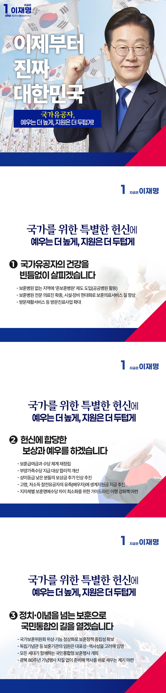

# 보훈 정책



```
국가를 위한 특별한 헌신에 예우는 더 높게 지원은 더 두텁게 하겠습니다.

```

오늘날 우리가 누리는 자유와 평화, 민주주의와 번영은 순국선열과 호국영령, 그리고 민주열사들이 흘린 피와 땀의 결실입니다.

국가의 기본 책무는 애국심을 명예롭게 지켜 드리는 일입니다. 국가유공자와 유가족 여러분이 자부심과 긍지를 느끼실 수 있도록, 예우는 더 높게,
지원은 한층 더 두텁게 하겠습니다.

독립, 호국, 민주를 보훈의 세 축으로 삼아 인식과 처우를 개선하고, 특별한 헌신에 걸맞은 예우를 강화하겠습니다.

### 첫째, 국가유공자의 건강을 빈틈없이 살피겠습니다.

사각지대 없는 보훈 의료 체계를 구축해 건강한 일상을 뒷받침하겠습니다.

보훈병원이 없는 지역에는 공공병원을 활용해 보훈병원에 준하는 의료혜택을 제공하는 ‘준 보훈병원’ 제도를 도입하겠습니다.

보훈병원 전문 의료진을 늘리고, 시설과 장비를 현대화해 의료서비스의 질을 높이겠습니다.

보훈병원 방문진료사업을 확대 개편해 거동이 불편한 분들을 위한 의료 체계도 강화하겠습니다.

### 둘째, 헌신에 합당한 보상과 예우를 하겠습니다.

보훈급여금과 수당체계를 재정립해 국민 눈높이에 맞는 현실적인 보훈보상 방안을 마련하겠습니다.

부양가족수당 지급 대상을 합리적으로 개선하고, 상이등급이 낮은 분들의 보상금 추가 인상도 추진하겠습니다.

참전유공자가 돌아가신 이후 정부 지원이 중단돼 생계를 걱정하는 저소득 고령자 유족들이 생기지 않도록 하겠습니다.

지자체별 보훈명예수당의 격차를 줄이고, 고령 국가유공자를 위한 맞춤형 종합대책도 준비하겠습니다.

### 셋째, 정치와 이념을 넘는 보훈으로 국민 통합의 길을 열겠습니다.

보훈은 과거의 희생을 예우하고 공동체의 미래를 함께 여는 국민 통합의 기반입니다.

국가보훈위원회의 위상과 기능을 정상화해 보훈정책의 중립성을 확보하겠습니다.

독립기념관 등 보훈 공공기관의 임원은 대표성과 역사성을 고려해 임명하겠습니다.

보훈행사는 모든 세대가 함께하는 국민통합의 장이 되도록 준비하겠습니다. 광복 80주년 기념행사를 차질 없이 준비해 역사를 바로 세우는 계기로
삼겠습니다.

국가를 위한 특별한 헌신에 합당한 대우를 보장하겠습니다.

이제부터 진짜 대한민국
지금은 이재명입니다.