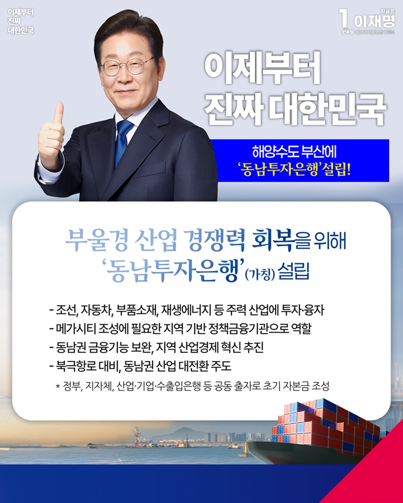

# 동남투자은행(가칭) 설립



```
해양수도 부산에 동남투자은행(가칭)을 설립하겠습니다
```

부산, 울산, 경남은 조선과 자동차, 석유화학, 기계산업 등 중화학공업의 중심지로 성장했습니다. 그러나 산업구조가 재편되고 글로벌 산업 환경이
급변하면서 세계시장에서의 경쟁력이 약해지고 있습니다.

지역 기업들은 수도권에 집중된 금융 인프라로 인해 자금 조달과 투자유치에 어려움을 겪고 있습니다. 부울경의 미래산업을 키우고 지역경제를
되살리려면, 지역 맞춤형 금융 지원 체계를 시급히 구축해야 합니다.

부울경 산업의 경쟁력을 회복하고 지속 가능한 성장을 이끌 ‘동남투자은행(가칭)’ 설립을 추진하겠습니다.

대규모 정책 기금을 운용해 조선, 자동차, 부품소재, 재생에너지 등 주력 산업에 자금을 투자하고 융자하며, 산업 육성과 인프라 조성을 책임지겠습니다.

동남투자은행은 5극 3특 국가 균형발전 전략의 핵심인 메가시티 조성에 꼭 필요한 지역 기반 정책 금융기관입니다. 국가 지원과 지역 연계를 바탕으로
부울경과 동남권의 금융 기능을 보완하고, 지역 산업경제의 혁신을 이끌겠습니다.

약 3조 원 규모의 초기 자본금은 중앙정부와 지방자치단체, 산업은행, 기업은행, 수출입은행 등이 공동 출자해 마련하겠습니다.

해양금융으로 북극항로를 뒷받침하고, 산업금융으로 동남권 제조업 밸트의 산업 대전환을 주도하며, 지역 경제의 선순환 구조를 이끄는 국책은행으로
자리매김하겠습니다.

동남투자은행 설립은 구여권 인사도 검토했던 현실적인 안입니다. 해양수도 부산에 들어설 동남투자은행은 갈등만 키우고 진전 없이 반복된 산업은행
이전 논란을 넘어서, 해양・산업금융을 실질적으로 지원하고 청년 일자리 확대까지 실현하는 대안이 될 것입니다.

이제부터 진짜 대한민국
지금은 이재명입니다.