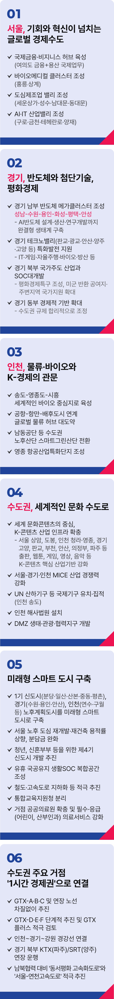

# 서울 경기 인천

## 세계를 선도하는 K-수도권,
### 국제 경제와 문화의 중심으로 우뚝 세우겠습니다



```
세계를 선도하는 K-수도권,
국제 경제와 문화의 중심으로 우뚝 세우겠습니다
```

대한민국의 관문 서울·인천·경기는 전통과 현대, 역사와 첨단이 자연과 어우러져 있습니다.

대한민국 대표를 넘어 규모와 경쟁력을 갖춘 세계 도시 서울, 대한민국은 인천을 통해 세계로 뻗어 나가고, 세계는 인천을 통해 대한민국을 만납니다.

첨단산업과 글로벌 공급망의 주요 거점인 경기는 나날이 새로운 변화를 만들어 가고, 과거의 역사를 오늘에 되살려 세계에 평화의 의미를 전하는 접경지역 역시 수도권에 포함하고 있습니다.

대한민국의 대표주자, 서울·인천·경기가 중심이 되어 대한민국의 운명을 개척해야 합니다. 세계 모범을 따라가는 추격국가에 안주하지 말고 세계를 주도하는 선도국가로 거듭나야 합니다.

세계적인 도시 서울, 세계를 만나는 관문 인천, 세계의 미래가치를 만드는 경기가 함께 한다면, 진짜 대한민국은 꿈이 아닌 현실이 될 것입니다. 서울을 뉴욕에 버금가는 글로벌 경제수도로, 인천을 물류와 바이오산업 등 K-경제의 글로벌 관문으로, 반도체와 첨단기술, 평화·경제의 경기로, 수도권 K-이니셔티브를 만들겠습니다.

### 첫째, 아시아를 넘어 세계 경제의 중심으로 나아가겠습니다.

서울은 뉴욕, 런던, 파리와 경쟁하는 글로벌 경제수도로 도약해야 합니다.

여의도 금융허브와 용산 국제업무지구를 하나로 연결해, 글로벌 자본과 기업들이 모이는 세계적 금융·비지니스 거점으로 만들겠습니다.

홍릉과 상계는 바이오메디컬 클러스터로, 세운상가, 남대문, 동대문, 성수동은 도심제조업 밸리로, 구로, 금천, 테헤란로, 양재는 AI·IT 산업 밸리로 재편해, 기회와 혁신이 넘치는 산업 거점으로 만들겠습니다.

경기도를 세계 반도체 산업 중심지로 키우겠습니다.

성남, 수원, 용인, 화성, 평택, 안성에 조성되는 반도체 메가 클러스터는, 연구개발부터 설계, 테스트, 생산까지 아우르는 완결형 생태계가 될 것입니다.

이에 필요한 투자 인센티브를 제공하고 전력, 용수 공급 등 지원을 강화해 조속히 완성하겠습니다.

판교, 광교, 안산, 양주, 고양 등 테크노벨리는 IT와 바이오, 게임과 자율주행, 방위산업 등으로 특화하고, 각 시·군 산업단지와 연계해 글로벌 경쟁력을 높이겠습니다.

경기 북부는 국가가 주도해 산업과 SOC 대개발을 과감히 추진하겠습니다.

오랫동안 발전의 혜택에서 소외된 접경지역에는 평화경제특구를 조성해, 평화산업과 녹색산업을 육성하겠습니다. 미군 반환 공여지와 주변 지역도 국가 지원을 확대하겠습니다.

해당 지역에 이전·신설하는 기업에는 세제 혜택과 규제 완화 등, 각종 인센티브를 제공해 국가안보를 위한 희생에 합당한 보상을 하겠습니다. 경기

동부는 수도권 규제를 합리적으로 조정해 경제 기반을 확대하겠습니다.

인천은 공항과 항만, 배후도시를 연계한 글로벌 물류 허브를 목표로 지원하겠습니다.

송도, 영종도, 시흥 일대는 첨단 연구개발과 생산을 아우르는 세계적인 바이오 메가 클러스터로 키우겠습니다.

남동, 반월, 시화 등 노후산업단지는 한국형 스마트 그린산단으로 재정비하고, 영종도에는 항공산업특화단지를 조성해 지속가능한 미래산업 생태계를

구축하겠습니다.

### 둘째, 수도권을 세계적인 문화수도로 만들겠습니다.

대한민국의 문화가 세계의 문화가 되고 있습니다. 수도권이 그 중심에서 세계 문화 수도로의 도약을 이끌게 하겠습니다.

600년의 역사와 마천루 숲이 조화롭게 공존하는 서울의 도시문화, 바다로 세계와 연결되는 인천의 해양문화, 다양하고 역동적인 경기의 융합문화가, 글로벌 문화수도의 토대가 될 것입니다.

서울 상암, 도봉 등지에 K-콘텐츠 산업 인프라를 확충하겠습니다.

경기 파주, 고양, 판교, 부천 등 K-콘텐츠 산업을 세계 문화콘텐츠의 중심으로 도약시키겠습니다.

인천항은 동북아 ‘모항 크루즈’ 기반을 강화하고, 인천 영종도·청라에 영상문화 복합클러스터를 조성해, 인천항과 인천공항을 K-콘텐츠 산업과 국제 콘텐츠 교류의 관문으로 만들겠습니다.

서울, 경기, 인천의 MICE 산업 경쟁력을 높이고, 인천 송도 등에는 UN 산하기구를 비롯한 국제기구를 유치해, 국제회의, 전시·관광·비즈니스가 어우러지는 글로벌 교류의 중심지로 육성하겠습니다.

해사법원은 부산과 인천 두 곳에 본원을 설치하고, 인천에 설치될 법원은 국제 해사 사건 전문법원으로 특화 발전시키겠습니다.

DMZ 일대는 생태·관광협력지구로 개발해 남북 평화교류의 실질적 기반을 마련하고, 세계인이 찾아 의미와 재미를 모두 추구할 수 있는 평화관광 명소로 조성하겠습니다.

### 셋째, 미래형 스마트도시를 구축하고 생활 인프라를 확충하겠습니다.

1기 신도시(분당, 일산, 산본, 중동, 평촌)는 노후 인프라를 전면 재정비해, 도시 기능과 주거 품질을 함께 높이겠습니다.

수원, 용인, 안산과 인천 연수·구월 등 노후 계획도시 정비도 적극 지원하겠습니다.

서울의 노후 도심은 재개발·재건축 진입장벽을 낮추고, 용적률 상향과 분담금 완화를 추진하겠습니다.

교통이 편리한 제4기 스마트 신도시 개발을 준비해, 청년과 신혼부부 등 무주택자에게 쾌적하고 부담 가능한 주택을 공급하겠습니다.

공공청사와 유수지 등 유휴 국공유지는 공공주택과 녹지, 생활 편의시설이 어우러진 복합 공간으로 조성하겠습니다.

지역 단절로 상권을 약화시키고 소음과 분진으로 피해를 주는 철도와 고속도로는 단계적으로 지하화하겠습니다.

여러 지자체를 관할하는 통합교육지원청은 소관 교육청과 협의로 조속히 분리해 교육환경을 개선하겠습니다.

주민 건강을 책임지는 거점 공공의료원을 확충하고, 의료 인력을 확보해 필수·응급(소아과, 산부인과) 의료서비스를 강화하겠습니다.

넷째, 수도권 주요 거점을 1시간 경제권으로 연결하겠습니다.

서울, 경기, 인천은 통합된 하나의 경제공동체가 되어야 합니다.

GTX-A·B·C 노선은 지연되지 않게 추진하고, 수도권 외곽과 강원까지 연장도 적극 지원해, GTX 소외지역을 줄여 가겠습니다.

GTX-D·E·F 등 신규 노선은 지역 간 수요와 효율성을 고려해 단계적으로 추진하고, 경기도가 제안한 GTX플러스 노선도 적극 검토하겠습니다.

인천과 경기, 강원을 경강선으로 연결하고, 경기 북부 접경지까지 KTX(파주)와 SRT(양주)를 연장 운행하겠습니다.

강화에서 경기 북부와 강원 고성을 연결하는 동서평화고속화도로와 서울과 연천을 잇는 서울~연천고속도로를 적극 추진해 남북협력시대를 대비하겠습니다.

지자체의 주요 광역교통 계획과 국책사업을 유기적으로 연계해 촘촘한 교통망을 구축하겠습니다.

서울·인천·경기가 각각의 장점을 최대화하고 수도권이라는 시너지로 융합될 때, 대한민국은 미래를 향해 달릴 수 있습니다. 대한민국이 세계를 주도할 수 있습니다.

서울의 글로벌 경제력, 경기의 첨단 산업력, 인천의 국제 물류 경쟁력을 하나로 묶어, 세계를 이끌고, 세계가 따르고 싶은 ‘국제 경제·문화 수도권’으로 도약하겠습니다.

이제부터 진짜 대한민국!

지금은 이재명입니다!