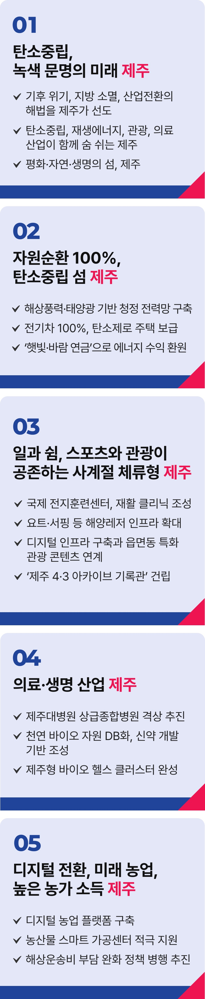

# 제주

## 탄소중립, 녹색 문명의 섬
### 탄소중립 K-이니셔티브, 제주에서 시작합니다



```
탄소중립 K-이니셔티브,
제주에서 시작합니다
```

제주는 대한민국의 역사, 문화적 정체성, 대안적 삶에서 다층적 중요성을 지닌 매우 특별한 곳입니다.

특별함을 간직한 제주에 이제 세계를 주도할 새로운 힘을 더해야 합니다.

대한민국 대표 관광지이자 휴식과 힐링의 공간인 제주가 관광 경기 침체로 성장동력까지 흔들리고 있습니다.

제주를 탄소중립 선도 도시이자, 농업과 관광, 생명과 돌봄이 어우러진 세계적 관광지로 육성하겠습니다.

제주를 2035년까지 탄소중립 선도 도시로 만들겠습니다.

해상풍력과 태양광으로 청정 전력망을 구축하겠습니다.

그린수소와 에너지 저장 기술개발로 안정적인 에너지 공급 체계를 완성하고, 전기차와 충전 인프라를 확충해 친환경 모빌리티 100% 전환을 앞당기겠습니다.

제주를 분산 에너지 특구로 지정하고 실시간 요금제, 양방향 충전을 비롯해 에너지 신기술의 실험 기지로 만들겠습니다.

자가용 태양광과 히트펌프를 연결해 탄소 제로 주택 시대를 열겠습니다.

햇빛연금, 바람연금 등 주민소득형 재생에너지 사업을 육성하고, 도민 참여 기회를 대폭 확대하겠습니다.

제주를 탈 플라스틱 중심지, 재활용률 100%의 자원순환 혁신 중심지로 만들어 세계의 모범으로 삼겠습니다.

일과 쉼이 공존하는 세계적 관광 도시로 육성하겠습니다.

디지털 인프라 확충을 적극 지원하겠습니다.

여행자와 비즈니스 출장자들이 어디서든 언제나 휴식과 일을 병행할 수 있게 편리함과 효율성을 두루 갖춘 공유 오피스와 숙소를 늘리겠습니다.

한달살이뿐 아니라, 더 길게 머물면서도 일과 여가를 병행할 수 있는 제주를 만들겠습니다.

‘제주에 간다’는 말이 ‘힐링하러 간다’, ‘꿈꾸러 간다’가 되도록 제주의 가치를 높이겠습니다.

읍면동에 따라 각기 다른 고유의 체험과 예술, 음식 문화를 살려 지역 맞춤형 관광거점이 되도록 적극 지원하겠습니다.

AR(증강현실)과 VR(가상현실)에 기반한 스마트해설 시스템 확대 등, 보다 다양한 체험이 가능한 새로운 관광 인프라를 구축하겠습니다.

국제 기준에 맞는 스포츠 전지훈련센터와 다목적 체육 인프라 구축을 지원하겠습니다.

축구, 야구, 육상 등 종목별 글로벌 전지훈련지와 재활의학 센터, 스포츠 클리닉까지, 훈련과 회복을 아우르는 복합단지 조성에 박차를 가하겠습니다.

요트·카약·서핑 등 해양레저 체험시설을 늘리고, 국제 요트대회 등, 해양스포츠 대회를 유치할 수 있도록 적극 지원하겠습니다.

관광과 레저가 융합된 마이스(MICE) 산업기반을 확충해 글로벌 컨벤션 유치를 활성화하겠습니다.

건강과 미래 산업이 함께 숨 쉬는 생명산업 거점으로 키우겠습니다.

제주 농업을 미래 산업으로 전환 시키겠습니다.

디지털 농업 플랫폼과 스마트팜 인프라를 확충하고, 농산물 스마트 가공센터 구축을 적극 지원하겠습니다.

자원순환형 축산과 유기농 농업을 지원하겠습니다.

디지털 물류 플랫폼과 스마트 공동 물류 인프라를 구축으로 농‧축‧수산물과 생필품 가격에 거품이 없도록 하겠습니다.

해상운송비 부담 완화도 함께 추진하겠습니다.

제주대학교병원을 상급종합병원으로 육성해, 제주에서도 최고 수준의 의료서비스를 누릴 수 있게 하겠습니다.

제주가 보유한 천연 바이오 자원을 발굴하여, 데이터베이스를 구축하겠습니다.

이를 기반으로 신약 연구개발센터와 산업 인프라를 조성해 ‘제주만이 가질 수 있는 바이오산업’ 기반을 다지겠습니다.

공공의료, 바이오산업, 관광과 치유가 융합된 ‘제주형 바이오 헬스 클러스터’를 완성하겠습니다.

세계기록유산으로 등재된 제주 4.3의 정신을 기리기 위해 ‘제주 4·3 아카이브 기록관’ 건립도 추진하겠습니다.

평화와 치유의 섬, 자연과 생명의 가치를 품은 제주가 더 성장하고 더 넓어져 세계를 주도할, 또 하나의 중심지로 거듭날 것입니다.

‘탄소중립 K-이니셔티브 제주’와 함께,

이제부터 진짜 대한민국,

지금은 이재명입니다.