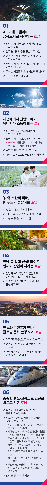

# 호남

## 미래 산업의 심장
### AI 에너지 산업과 농생명이 함께 성장하는 지속가능한 메가시티,새로운 호남 시대를 열겠습니다



```
AI 에너지 산업과 농생명이 함께 성장하는
지속가능한 메가시티,
새로운 호남 시대를 열겠습니다
```

"가만히 생각건대, 호남은 국가의 보루이다(竊想湖南國家之保障: 절상호남국가지보장)”.

이순신 장군이 하신 이 말씀은, 호남의 소명이자 자긍심입니다.

호남은 그 소명대로 우리 역사에서 늘 빛을 발해 왔습니다.

그러나 수도권 집중과 산업전환의 도전이라는 이중고 가운데 일자리가 사라졌고 이에 기회를 잃은 청년들이 떠나고 있습니다.

소득 불균형과 사회 양극화는 더 심해져 어느덧 호남은 활력을 잃어가고 있습니다.

불균형발전의 피해지역이 된 호남을 제대로 발전시켜야 합니다.

대한민국 국가균형발전의 완성을 위해서도 꼭 해야 할 일입니다.

수도권 집중을 넘어서기 위한 ‘호남권 메가시티’를 실현하겠습니다.

호남이 대한민국 산업화 과정 속에서 소외돼 온 만큼 인공지능(AI)으로 대표되는 첨단시대를 맞아 신성장동력 산업이 호남에 안착할 수 있도록 만들겠습니다.

호남은 충분한 성장 잠재력을 갖고 있습니다.

해상과 육상 교통의 연결점이면서 풍력과 태양광 등 재생에너지의 산실인 호남권을 발전시킨다면, 물류부터 에너지 독립까지 지속가능한 지역균형발전의 마침표가 될 것입니다.

호남권의 ‘경제부흥 시대’를 확실하게 열겠습니다.

### 첫째, AI와 미래 모빌리티․금융산업을 육성해 고부가가치 산업전환을 지원하겠습니다.

광주는 ‘국가 AI 데이터센터’에 이어, 고성능 반도체를 집적한 ‘국가AI 컴퓨팅센터’까지 확충해 AI 선도 도시로 만들겠습니다.

AI 집적단지와 미래 모빌리티 부품 클러스터를 조성해, 첨단산업 생태계를 구축하겠습니다.

전주는 자산운용 특화 금융 생태계를 조성해, 제3의 금융 중심지로 도약시키겠습니다

여수의 주력 산업을 석유화학에서 친환경·고부가가치 화학산업으로 전환하고, 광양 제철산업의 수소환원제철 기술 전환을 적극 지원하겠습니다.

목포는 해상풍력 및 전기선박 산업 중심지로 키우고, 군산은 조선소 재도약으로 일자리를 대폭 늘리겠습니다.

새만금 이차전지 특화단지는 성공적인 국가첨단전략산업 단지로 조성하기 위해, 기업 유치를 적극 지원하겠습니다.

### 둘째, 호남을 재생에너지 산업의 중심지로 만들겠습니다.

해상풍력과 태양광 산업은 전용 부두와 배후단지를 갖춘 완성형 생태계로 구축하겠습니다.

‘에너지 고속도로’를 빠르게 조성해 주요 산업단지와 연결하겠습니다.

광주와 새만금 등 전남·전북 일대에 RE100 산업단지를 조성하겠습니다.

해남은 재생에너지 기반의 세계 최대 AI 데이터센터 구축을 지원하겠습니다.

나주는 한국전력과 한국에너지공대가 에너지 신산업 발전의 중심이 되도록 지원하겠습니다.

새만금·부안 ·신안·고흥·여수 일대의 주민들과 함께 태양광과 해상풍력 프로젝트를 성장시키겠습니다.

새만금 해수유통(새만금호 수질 개선을 위한 수문개방)을 확대하여 생태계를 복원하고, 사회적 합의를 통해 조력발전소 건설도 검토하겠습니다.

태양과 바람이 만든 수익은 ‘햇빛, 바람 연금’이 되어 지속 가능한 지역 소득이 되도록 지원하겠습니다.

### 셋째, 호남을 미래형 농생명·식품 산업과 공공의료의 거점으로 키우겠습니다.

농업과 에너지가 함께 가는 시대, 영농형 태양광을 확대해 기후, 식량 위기에 대응하겠습니다.

전기 트랙터와 전기 축분 처리기 등 친환경 농기계를 보급해 농업의 탈탄소 전환을 앞당기겠습니다.

김제 스마트팜 혁신밸리, 나주 AI 농업 지구 등을 거점으로 고부가가치 농생명 산업을 육성하고,

종자, 식물 단백질, 스마트 농업 기술 개발에 집중적으로 투자하겠습니다.

지역 단위 자원 순환형 축산 공동체를 확산하고, 저탄소 축산 시스템 전환을 지원하겠습니다.

생산, 가공, 수출이 연결되는 수산클러스터를 조성하고, 해양식품 산업벨트를 구축하겠습니다.

전북 국가식품클러스터는 K-푸드 수출거점으로 성장시키고, 제조와 수출, 체험이 융합된 K-푸드파크 조성도 뒷받침하겠습니다.

화순 백신 특구는 백신, 항암, 면역 중심의 첨단 바이오‧헬스 클러스터로 도약할 수 있도록 지원하겠습니다.

의대가 없는 유일한 광역지자체인 전남과 의대(서남대)가 폐교된 전북에는, 국립 의대를 설립해 공공·필수·지역의료 인력을 직접 양성하겠습니다.

### 넷째, 2036년 하계올림픽 유치를 전폭 지원하고, 세계적인 문화·관광 벨트를 조성하겠습니다.

올림픽은 전북의 문화와 관광을 세계에 알릴 절호의 기회입니다.

전주의 한식과 후백제 유산을 세계적 문화자산으로 육성하겠습니다.

광주는 아시아 콘텐츠 거점도시로 고도화하겠습니다.

창작, 공연, 영상산업 등 문화 기반 창업을 활성화하도록 하여, 국제교류 플랫폼 강화도 지원하겠습니다.

서남해안과 내륙이 함께 성장하는 생태·해양·치유 관광 벨트를 만들겠습니다.

남해안의 해양·문화 자산(순천만 갯벌, 변산반도 지질자원, 신안 다이아몬드 제도, 여수 화양 복합 관광단지)을 유기적으로 연결하고, 서남해 다도해를 예술과 자연이 어우러진 체류형 관광지로 키우겠습니다.

이를 통해 순천·신안·여수·해남·완도를 대표 관광 거점으로 만들겠습니다.

남원·장수·무주·구례 등 전북·전남 동부권은 치유 관광과 친환경 농업 중심으로 육성하고, 유기농 식품, 고랭지 특산물, 생태·전통문화 자산을 연계해, 지속 가능한 농촌 관광과 산업 혁신 모델을 만들겠습니다.

### 다섯째, 호남권에 촘촘한 교통망을 구축해 수도권과 영남권까지 넓게 잇겠습니다.

호남고속철도 2단계는 조기 완공하고, 전라선 고속철도는 신속히 추진해 수도권 접근성을 높이겠습니다.

서해선 철도 고속화는 조속히 마무리하고, 군산, 새만금, 목포까지 단계적 연결을 추진하겠습니다.

경전선 전철화도 차질 없이 추진되도록 적극적으로 지원하겠습니다.

고흥~광주~전주~세종을 잇는‘호남권 메가시티 고속도로’가 ‘제3차 고속도로 건설 국가 계획’에 반영될 수 있도록 지원하겠습니다.

광주~대구 달빛 철도와 전주~대구 고속도로를 조속히 추진하겠습니다.

새만금~포항 고속도로 전 구간 개통도 지원하겠습니다.

광주~나주, 광주~화순 광역철도 연장을 신속히 추진해, AI와 에너지 산업을 연결하고 하나의 생활권으로 통합하겠습니다.

서해안 생태관광 활성화와 지역 연계를 위해, 부안~고창 노을 대교의 조속한 착공을 지원하겠습니다.

서남해안 일주 관광도로와 완도, 고흥 연결도 적극 지원하겠습니다.

광주 군 공항 이전은 충분한 협의를 바탕으로 추진하며, 이전 지역이 함께 발전할 수 있게 적극 지원하겠습니다.

호남은 위기의 순간마다 나라를 지켜온 자존의 땅입니다.

민주주의가 위태로울 때 광주는 온몸으로 진실을 지켰고, 산업화의 파고에도 농생명 뿌리를 지켜냈습니다.

세 번의 민주정부를 만든 것도 호남이었습니다.

호남의 슬픔과 분노, 좌절과 절망을 용기와 투지로 바꿔 국가의 보루, 호남의 경제부흥을 이뤄야 합니다.

저 이재명은 호남의 손을 굳게 잡고 대한민국의 대전환을 완수해 ‘K-이니셔티브’ 시대를 열겠습니다.

이제부터 진짜 대한민국!

지금은 이재명입니다!