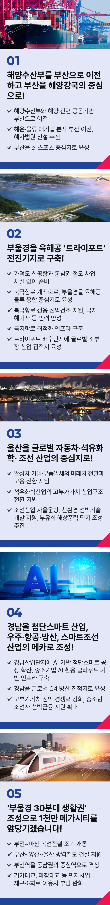

# 부산 울산 경남

## 글로벌 해양수도, 미래산업을 선도하는
### 부울경 메가시티를 대한민국 해양 수도로 만들겠습니다



```
부울경 메가시티를 대한민국 해양 수도로 만들겠습니다
```

부산, 울산, 경남은 대한민국 산업화의 중심이자, 수출 강국 대한민국의 심장이었습니다.

하지만 성장신화를 주도했던 동남권은 지금 중대한 기로에 서 있습니다.

수도권 집중과 산업전환의 도전이라는 이중고 속에 일자리는 사라지고, 기회를 잃은 청년들은 떠나고 있습니다.

제조업 기반이 흔들리며, 지역 상가의 불은 꺼지고 있습니다.

* 전국평균 고용률 62.5% 부산(광역단체 중 16위) 58.4% 대구(17위) 58.2%

그러나 여기서 멈출 수는 없습니다.

오늘의 대한민국을 만든 부울경의 저력은 세계를 주도할 대한민국의 미래와 만날 가능성과 잠재력으로 준비되어 있습니다.

부울경의 제조업과 항만은 대한민국의 회복과 성장을 이끌 핵심 자산입니다.

북극항로 개척과 대륙철도 연결로, 미래산업 전환에 대한 과감한 투자로,해양수산부 이전과 30분대 생활권 구축으로 ‘융합의 허브, 부울경 메가시티’를 글로벌 물류와 산업 중심의 해양수도로 만들겠습니다.

### 첫째, 부산을 명실상부 해양강국의 중심으로 만들겠습니다.

대한민국의 해양강국 도약과 현장 중심 정책집행을 위해 해양수산부를 부산으로 이전하겠습니다.

이를 통해 조선, 물류, 북극항로 개척 등 첨단 해양산업 정책의 집행력을 확보하겠습니다.

국내외 해운·물류 대기업 본사와 R&D센터를 유치해 해양클러스터를 조성하여, 청년들이 선호하는 좋은 일자리를 만들겠습니다.

해운·물류 관련 공공기관 이전을 추진하고 해사 전문법원도 신설해, 해양강국의 기반을 탄탄히 다지겠습니다.

지역 전략산업, 소부장 제조기업, 스타트업 등에 성장단계별 맞춤형 자금을 안정적으로 공급하겠습니다.

이에 더해 부산을 청년이 모이고, 세계가 주목하는 e-스포츠 산업 중심지로 키우겠습니다.

### 둘째, 부울경을 육해공 ‘트라이포트’ 전진기지로 만들겠습니다.

가덕도 신공항과 동남권 철도 사업을 차질 없이 준비하고, 대륙철도 연결의 기회를 더해 부울경을 융합 물류의 중심지로 키우겠습니다.

북극항로라는 새로운 기회를 대한민국이 선점해야 합니다.

쇄빙선 등 전용 선박 건조를 지원하고, 극지 해기사 등 전문 인력도 신속히 양성하겠습니다.

항로 최적화 연구와 물류 운송로 확보, 북극항로 비즈니스 모델 개발까지, 북극항로에 최적화된 인프라를 구축해 가겠습니다.

트라이포트 배후단지에는 소재·부품·장비 공급망을 집중해 글로벌 소부장 산업 집적지로 육성하겠습니다.

### 셋째, 울산의 자동차·석유화학·조선산업을 글로벌 친환경 미래산업 선도주자로 키우겠습니다.

전기차·수소차 인프라를 전국으로 확충하여, 친환경 미래차 전환 시점을 앞당기겠습니다.(현재 목표 2040년)

현대자동차 등 완성차기업은 물론, 부품기업의 미래차 산업전환도 적극 지원하겠습니다.

맞춤형 R&D와 고용 안전망 제공 등 산업·고용 전환을 종합 지원해, 울산을 친환경 모빌리티 중심지로 만들겠습니다.

석유화학산업 재도약도 적극 뒷받침하겠습니다.

재생에너지 기반 생산공정을 구축하고 친환경 기술개발을 지원해, 고부가가치 산업구조로의 전환을 돕겠습니다.

자율운항과 친환경 선박 기술개발을 지원하고, 부유식 해상풍력단지 조성을 성공적으로 추진하겠습니다.

### 넷째, 경남을 우주‧항공‧방산, 스마트 조선산업의 메카로 만들겠습니다.

경남의 전통 제조업의 디지털 전환을 본격 지원하겠습니다.

제조 특화 AI 모델과 플랫폼을 개발하고, AI 기반 스마트 공장을 확산하겠습니다.

중소기업이 AI를 쉽게 활용할 수 있게 클라우드 기반 인프라 구축을 지원하겠습니다.

‘디지털 융합 스마트 산업단지’ 전환을 신속히 추진하겠습니다.

방산 부품 R&D를 전폭 지원해 국산화를 촉진하고, 기술 자립도를 향상해

글로벌 G4 방산 집적지로 키우겠습니다.

항공산업과 우주산업 육성도 적극 뒷받침하겠습니다.

항공기, 미사일·위성, 항공전자 등 전후방 산업을 육성해 ‘동북아 우주·항공산업 허브’로 도약시키겠습니다.

최근 한미 간 군함 및 상업용 조선산업 협력이 강화되며, 기술 교류와 수주 확대 가능성이 커지고 있습니다.

고부가가치, 특수선박의 설계·건조 역량을 높이고, 중소형 조선소에는 선박금융 지원을 확대해 글로벌 강소 조선사로 성장을 돕겠습니다.

다섯째, 부울경의 30분대 생활권을 조속히 실현하겠습니다.

부울경을 하나의 생활·경제권으로 연결하는 GTX급 광역교통망을 완성하겠습니다.

부전역~마산역 복선전철의 조기 개통과 함께, 비수도권 광역철도 선도 사업인 부산~양산~울산선 건설을 적극 지원하겠습니다.

부산역 철도 지하화사업이 차질없이 추진되도록 뒷받침하고, 지하화를 단계적으로 확대하겠습니다.

부전역은 동남권 중심역으로 격상하고, 중앙선·동해선·경전선·가덕신공항을 연결하는 철도 허브로 육성하겠습니다.

통행료 부담이 큰 거가대교, 마창대교 등은 민자사업 재구조화로 이용자의 부담을 줄이겠습니다.

부울경 30분대 생활권 시대는 1천만 메가시티를 앞당길 것입니다.

존경하는 부산시민, 울산시민, 경남도민 여러분!

부산, 울산, 경남은 대한민국 산업을 일으킨 선봉장으로, 수출 강국을 가능하게 한 주역이었습니다.

이제 산업화의 기적을 넘어, 미래산업으로의 대전환이라는 새로운 도약을 함께 만들어야 합니다.

부산의 항만과 해양 울산의 자동차, 석유화학, 조선 경남의 우주항공, 방위, 조선, 풍력산업이 함께 손잡고 혁신과 창조의 시너지를 만들 것입니다.

이를 통해 부울경 메가시티의 꿈은 동북아 대표 광역경제권, 대한민국 해양수도로 실현될 것입니다.

대한민국 회복과 성장의 새 엔진,

부울경과 함께 힘차게 뛰겠습니다.

이제부터 진짜 대한민국,

지금은 이재명입니다.