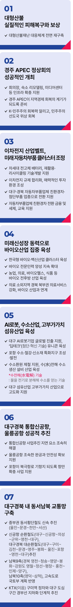

# 대구 경북

## 대한민국 산업화의 주역, 미래첨단산업도시
### 대한민국 경제 성장의 신화, 대구‧경북의 재도약을 이끌겠습니다.



```
대한민국 경제 성장의 신화,
대구‧경북의 재도약을 이끌겠습니다.
```

안동에 태를 묻고, 제 뼈와 살과 피를 만들어 준 대구·경북의 아들, 대구·경북 출신 민주당 경선 후보 이재명이 대한민국 경제 성장의 신화, 대구‧경북의 재도약을 이끌겠습니다.

### 첫째, 이차전지 산업벨트와 미래형 자동차 부품 클러스터를 조성하겠습니다.

대구‧구미‧포항을 글로벌 이차전지 공급망의 핵심 거점으로 육성하겠습니다.

구미(LG화학), 포항(소재 기업 및 R&D), 대구(소재클러스터‧순환파크)의 산업기반을 활용해 차세대 전고체 배터리와 리사이클링 R&D 역량 강화를 지원하겠습니다.

규제 합리화와 투자 환경 개선으로 대구‧경북이 글로벌 이차전지 산업을 선도할 수 있게 뒷받침하겠습니다. 관내 2,000여 자동차부품 기업이 친환경자동차, 첨단부품 산업으로 혁신할 수 있도록 지원하겠습니다.

자동차부품 R&D센터를 설립하고, 스마트 생산설비를 기반으로 산업생태계를 구축하겠습니다.

기업의 초기 투자를 장려하는 금융‧세제지원도 아끼지 않겠습니다.

지역 연구소와 대학이 함께하는 미래 직업 재교육과 인력 재배치 시스템을 구축하겠습니다.

### 둘째, 바이오산업을 미래 성장동력으로 육성하겠습니다.

대구‧경북 바이오 산업벨트를 ‘한국형 바이오‧백신 산업 클러스터’로 조성하겠습니다.

대구 첨단의료복합단지는 신약 개발, 혁신형 의료기기, 디지털 헬스 케어를 집중 육성하고, 초격차 기술 역량을 높여 국제 경쟁력을 강화하겠습니다.

경북바이오산업연구원·포스텍 등의 바이오·신소재 기술개발과 연구를 적극 지원하고, 전문 인력을 지속적으로 양성하겠습니다.

농업, 의료, 헬스 케어, 식품 등 전후방 산업을 육성해 대구‧경북 바이오산업 성장 잠재력을 현실로 만들겠습니다.

발효기술과 천연소재를 활용한 바이오 식품산업을 농업과 연계해 새로운 성장동력으로 키우겠습니다.

경북 북부권 거점병원의 의료서비스를 강화해 바이오산업과 연계하고, 영양·봉화·청송·예천 등 의료 소외지역의 의료격차도 해소하겠습니다.

### 셋째, AI로봇, 수소산업과 고부가가치 섬유산업을 미래 핵심 산업으로 키우겠습니다.

대구는 AI로봇산업 인프라를 갖춘 최적의 도시입니다.

AI로봇 딥테크 유니콘 기업을 집중 육성해 기술 경쟁력을 높이고, 세계 시장 진출을 지원하겠습니다.

구미 로봇직업혁신센터와 연계해 AI로봇 전문인력 양성과 재교육을 강화하겠습니다.

포항에는 수소‧철강‧신소재 특화 지구를 조성해 그린수소 생산부터 저장, 활용까지, 전 주기 산업 인프라를 완비하겠습니다

수소환원 제철과 수전해 수소생산설비 산업을 기존 철강산업과 연계해 전략적으로 육성하겠습니다.

대구 섬유산업은 친환경 신소재 개발과 고부가가치 산업으로 전환을 지원하겠습니다.

### 넷째, 대구‧경북 통합 신공항과 울릉공항을 성공적으로 추진하겠습니다.

대구‧경북 통합 신공항 사업 지연 요인을 조속히 해소하겠습니다.

활주로는 연장하고, 화물터미널도 확대하여 원거리 노선 운항이 가능한 공항이 되도록 적극 나서겠습니다.

울릉공항은 안전성을 높이고, 조속히 완공될 수 있도록 지원하여 울릉도 관광객 접근성을 높이고 지역경제 활성화에 기여하겠습니다.

포항 등 동남권 항만도시는 북극항로 기항지로 도약할 수 있도록 첨단 항만 인프라를 확충하겠습니다.

### 다섯째, 대구‧경북을 교통 허브로 성장시키겠습니다.

남부내륙철도와 달빛철도를 조속히 완공해 대구·경북을 수도권부터 중부권, 동남권, 호남권까지 연결하는 대한민국의 교통 중심지로 만들겠습니다.

중부권 동서횡단철도 신속 추진으로 대구‧경북 신공항과 광역 도로망, 철도망을 촘촘히 구축하겠습니다.

서대구와 의성, 영천을 연결하는 신공항철도와 대구와 구미, 영주, 포항을 거쳐 영천을 연결하는 순환 철도도 적극 추진하겠습니다.

경북 영천~청송~영양~봉화~강원도 영월~정선~평창~홍천~인제~양구의 남북 9축과 영덕에서 삼척까지 남북 10축 고속도로를 제3차 고속도로

건설계획(‘26~’30)에 반영해 단계적으로 확충하겠습니다.

KTX(이음) 구미역 정차와 대구 도심 경부선 지하화를 단계적으로 추진하겠습니다.

존경하는 경북도민, 대구시민 여러분!

대구·경북은 대한민국 산업화의 요람이었습니다.

대구·경북의 명성이 과거의 영광으로만 머물러서는 안 됩니다.

대구·경북에는 제조업과 첨단산업의 성장 잠재력이 무궁무진합니다.

성장 엔진을 다시 가동하고 산업 경쟁력을 회복하여 청년이 돌아오고 지역이 살아나는 활력 넘치는 대구·경북을 만들겠습니다.

대구·경북을 세계 어느 산업도시와 견주어도 손색없는 첨단산업의 중심지로 키우겠습니다.

대구·경북의 진짜 회복과 성장, 이재명이 하겠습니다.

이제부터 진짜 대한민국,

지금은 이재명입니다.

고맙습니다.