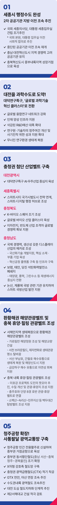

# 충청

## 행정·과학 수도, 충청
### 대한민국 균형발전의 심장, 충청을 행정‧과학 수도권으로 만들겠습니다



```
대한민국 균형발전의 심장,
충청을 행정‧과학 수도권으로 만들겠습니다.
```

충청은 국토의 중심이자 대한민국의 심장입니다. 수도권과 남부권을 잇는 전략적 요충지입니다. 충청의 심장이 힘차게 뛰어야, 대한민국 경제의 혈맥이 살아납니다.

수도권 집중으로 지역은 소외되고, 기회는 편중됐습니다. 국가가 나서야 합니다. 균형발전은 선택이 아닌 생존의 문제입니다. 충청에 맞는 산업을 배치하고, 과감한 투자로 새로운 미래를 만들어야 합니다. 저 이재명, 진짜 균형발전에 앞장서겠습니다.

충청을 ‘행정·과학 수도’로 조성해, 대한민국 균형발전의 중심축으로 삼겠습니다.

세종은 명실상부한 행정수도로, 대전은 세계적 과학수도로 만들겠습니다. 충북은 미래산업의 중심지로, 충남은 환황해권의 거점으로 완성하겠습니다.

### 첫째, 세종을 행정수도의 중심으로 완성하고 제2차 공공기관 이전을 조속히 추진하겠습니다.

국회 세종의사당과 대통령 세종 집무실을 임기 내 건립하겠습니다.

국회 본원과 대통령 집무실의 세종시 완전 이전도 사회적 합의를 거쳐 추진하겠습니다.

중단(2019년)된 공공기관 이전을 조속히 재개하겠습니다.

‘무늬만 혁신도시’가 아닌 실질적 기능을 갖추겠습니다.

대전과 충남 혁신도시에는 지역 경쟁력을 고려한 공공기관을 유치하겠습니다.

충북혁신도시는 중부내륙 성장거점으로 키우겠습니다.

### 둘째, 대전을 한 차원 높은 과학 수도로 만들겠습니다.

대덕연구특구를 글로벌 과학기술 혁신클러스터로 전환하겠습니다.

글로벌 융합연구 네트워크를 강화하고, 인재 양성 인프라 확충을 지원하겠습니다.

삭감된 R&D 예산은 대폭 늘리고, 연구자와 기술자 정주 여건도 개선하겠습니다.

성과 지원을 두텁게 해 무너진 연구 생태계를 다시 일으키겠습니다.

### 셋째, 충청권에 첨단산업벨트를 구축하겠습니다.

대전(AI·우주산업)~세종(스마트행정)~충북(바이오‧반도체‧이차전지)~충남(디스플레이)을 잇는 유기적인 첨단산업벨트를 구축하겠습니다.

대전 대덕연구특구는 AI와 우주산업 중심지로 키우겠습니다.

‘스마트시티 국가시범도시’ 전략과 연계해 세종을 스마트‧디지털 행정 허브로 자리매김하겠습니다.

충북은 K-바이오스퀘어를 조기 조성해 글로벌 바이오산업 클러스터로 육성하겠습니다.

이차전지‧반도체사업 분야는 R&D와 인력 양성 인프라를 강화해 초격차 경쟁력 확보를 지원하겠습니다.

충남은 국제 경쟁력과 생산성을 갖춘, 미래형 디스플레이 산업 메카로 만들겠습니다.

국산화 기술개발을 지원하고, 핵심 소재‧부품기업을 육성하겠습니다.

혁신공정 플랫폼 등 인프라도 갖춰 차세대 디스플레이 기술 확보를 지원하겠습니다.

보령‧태안‧당진에 있던 석탄화력발전소 폐쇄 지역을 태양광‧풍력‧그린수소 등 재생에너지 중심지로 전환하는 지역 지원 특별법을 추진하겠습니다.

논산, 계룡에 국방 관련 기관을 유치해 스마트 국방산업 발전을 지원하겠습니다.

### 넷째, 환황해권 해양관광벨트와 충북 휴양‧힐링 관광벨트를 조성하겠습니다.

서해안 해양 생태를 복원하고, 가로림만 해양정원 조성을 지원하겠습니다.

해상교량 건설로 서해안 관광도로망을 완성하겠습니다.

서천 브라운필드는 재자연화를 거쳐 생태관광 명소로 탈바꿈시키겠습니다.

서산 부남호와 간월호는 해수 유통 등 역간척 사업으로 생태계를 복원하고, 해양신도시 개발도 함께 지원하겠습니다.

금강 하구에 해수를 들여 자연성을 회복할 수 있도록 입법과 제도개선으로 뒷받침하겠습니다.

충북 내륙은 휴양·힐링 관광벨트로 발전시키겠습니다.

도민의 뜻을 모아 미호강 수질을 개선하고, 청주 ~ 증평 ~ 진천 ~ 음성까지 이어지는 관광·휴양지 조성을 지원하겠습니다.

충주호와 단양8경은 호반 관광 ‧ 휴양벨트로 연결하고, 소백산~속리산~장령산~민주지산을 잇는 백두대간 탐방벨트 조성도 지원하겠습니다.

### 다섯째, 청주공항을 확장하고, 사통팔달 광역 교통망을 구축하겠습니다.

청주국제공항에 민간전용 활주로를 신설해, 중부권 거점공항이 되도록 지원하겠습니다.

충남 서산~천안~청주~경북 울진을 잇는 중부권 동서횡단철도는 조기에 확정하겠습니다.

충북선‧호남선 고속화를 서둘러 X자형 강호축 철도망을 완성하겠습니다.

대전~세종~오송~청주공항을 연결하는 충청권 광역급행철도(CTX)는 적기에 착공하고, GTX의 천안‧아산 연장도 신속히 추진하겠습니다.

잠실 또는 동탄에서 청주공항까지 이어지는 수도권내륙 광역철도도 빠르게 추진하겠습니다.

우선 사업 대상지로 선정된 대전조차장 부지를 시작으로, 대전 도심 철도 지하화를 단계적으로 추진하겠습니다.

서해대교 인근 교통정체 해소를 위해 제2 서해대교 건설을 적극 검토하겠습니다.

존경하는 충청권 시민, 도민 여러분!

저는 늘 현장에 답이 있다는 신념으로 ‘가능성’을 ‘현실’로 만들어 왔습니다.

자부심 넘치고 행복한 도시 충청을 만들겠습니다.

4개 시도가 하나 되어 통합경제권을 만들고 함께 성장할 수 있도록 적극 지원하겠습니다.

충청이 살면 대한민국이 살 것입니다.

이제부터 진짜 대한민국,

지금은 이재명입니다.

감사합니다.