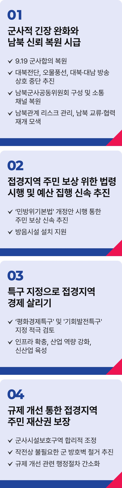

# 접경지

## 특별한 희생 특별한 보상 접경지역 발전!
### 일상의 안전을 강화하고 성장의 토대를 마련하겠습니다

대한민국은 세계 유일의 분단국가입니다. 한반도 평화는 국민의 안전과 우리나라 경제에 직결되는 핵심 과제입니다. 하지만 지난 정부 동안 9.19 군사합의는 무력화됐고, 남북 간 공식 대화는 끊겼으며, 북한은 ‘적대적 두 국가’를 선언했습니다. 한반도 긴장은 고조됐고, 국민 불안은 커졌으며, 국가경제는 후퇴했습니다.

남북관계가 악화되면서 접경지역 주민들은 매일을 불안 속에 살고 있습니다. 대남방송과 오물풍선 살포, 높아진 군사적 충돌 위험은 주민의 생명과 일상을 위협하고 있습니다.

국가는 국민이 안심하고 일상을 영위할 수 있고, 경제가 흔들리지 않도록 든든한 울타리 역할을 해야 합니다.

### 군사적 긴장 완화와 남북 간 신뢰 복원이 시급합니다.

9.19 군사합의를 복원하고, 대북전단과 오물풍선, 대북‧대남 방송을 상호 중단해 접경지역의 평화와 안전을 지키겠습니다. 남북군사공동위원회를 구성하고, 소통 채널을 복원해 군사적 충돌을 비롯한 남북관계 리스크를 안정적으로 관리하겠습니다. 남북이 교류협력을 재개하도록 모색하고, 상호 신뢰를 다시 세우겠습니다.

### 접경지역 주민의 일상 회복을 위한 법을 조속히 집행하고 예산도 신속히 편성 집행하겠습니다.

최근 통과된 ‘민방위기본법’을 조속히 시행해 접경지역 주민들이 겪는 신체적‧정신적 스트레스에 대한 빠른 보상을 이뤄내겠습니다. 예산집행도 속도를 내 소음피해로 인한 주민들의 고통을 덜어 줄 방음시설 설치를 지원하겠습니다.

### 평화경제특구 지정으로 접경지역의 경제를 살리겠습니다.

분단 이후 특별한 희생을 감내해 온 접경지역 주민들께는 특별한 보상이 필요합니다. 평화경제특구를 지정해 접경지역 경제에 활력을 불어넣겠습니다.

나아가 기회발전특구 지정을 적극 검토하겠습니다. 남북 교류 관문으로서 인프라를 확충하고, 산업 역량을 강화하겠습니다. 신산업을 육성하고, 앵커기업(선도기업)을 유치해 평화 거점도시로 육성시키겠습니다.

### 불필요한 규제를 과감히 개선하여 접경주민의 재산권을 보장하겠습니다.

경기도 접경지의 약 42%, 강원도의 50.2%가 군사시설 보호구역입니다. ‘작전수행’ 명목으로 군이 사유지를 점유해 주민들의 재산권이 침해받고 금전적 손해 등의 피해가 계속되고 있습니다. 군 작전상 제한이 없는 군사시설 보호구역은 합리적으로 조정하고, 불필요한 군 방호벽은 철거하겠습니다.

행정절차는 지자체로 위탁해 간소화하겠습니다. 국가를 위한 일방적인 희생이 더는 반복되지 않게 국가가 나서겠습니다.

지난 4월 25일 접경지역 주민들께서 제안하신 경제, 안보, 교육, 정주여건, 관광산업 발전 과제도 신속히 검토해 추진 방안을 마련하겠습니다.

불안이 아닌 평화, 지역경제 후퇴가 아닌 발전을 위해 최선을 다하겠습니다. 접경지역 주민의 평온한 일상과 더 나은 삶, 평화가 바탕이 된 더 나은 미래를 위해 이재명이 앞장서겠습니다.

이제부터 진짜 대한민국,

지금은 이재명입니다.